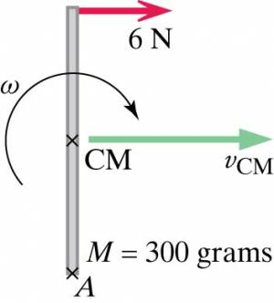

Consider a meter stick whose mass is 300 grams and that lies on ice (see representation in which we are looking down on the meter stick). You pull at one end of the meter stick, at right angles to the stick, with a force of 6 newtons. Assume that friction with the ice negligible. What is the rate of change of the center-of-mass speed $v_{CM}$? What is the rate of change of the angular speed $\omega$?

## Facts

Mass of meter stick 300g

Pull at end of meter stick at right angles to the stick: 6N

Remember a meter stick is a meter long

## Lacking

Rate of change of the center-of-mass speed $v_{CM}$?

Rate of change of the angular speed $\omega$?

## Approximations & Assumptions

No friction due to ice

Assume the meter stick is a uniform rod

## Representations

System: Stick

Surroundings: Your hand (pulling); ice (negligible effect)

$\frac{d\overset{\rightarrow}{P}}{dt}$ = ${\overset{\rightarrow}{F}}_{net}$

$\frac{d{\overset{\rightarrow}{L}}_{rot}}{dt}$ = ${\overset{\rightarrow}{\tau}}_{net,CM}$

$\tau = r_{A}Fsin\theta$​

${\overset{\rightarrow}{L}}_{rot} = I\overset{\rightarrow}{\omega}$​

## Solution

We can use the momentum principle to find the rate of change of the center of mass speed $v_{cm}$

We know that the change in momentum over change in time is equal to ${\overset{\rightarrow}{F}}_{net}$

$d\overset{\rightarrow}{P}/dt = d(m{\overset{\rightarrow}{v}}_{CM})/dt = {\overset{\rightarrow}{F}}_{net}$​

We are given ${\overset{\rightarrow}{F}}_{net}$ and the mass of the meter stick so we can find $v_{CM}$.

$dv_{CM}/dt = (6N)/(0.3kg) = 20m/s^{2}$​

Similarly we know that the Angular Momentum Principle about center of mass states that the change in Rotational Angular Momentum divided by the change in time is equal to the net torque about the center of mass of the meter stick.

$d{\overset{\rightarrow}{L}}_{rot}/dt = {\overset{\rightarrow}{\tau}}_{net,CM}$​

We know from the right hand rule that the component is into the screen (-z direction) and that $d{\overset{\rightarrow}{L}}_{rot}/dt = I\frac{d\omega}{dt}$

We also know that $\tau = r_{A}Fsin\theta$ and that $F = 6N$ and $\theta = 90^{\circ}$. We also know that $r$ is the distance from where the force is applied to the center of mass which is $.5m$. We input all these variables to the right hand side of our equation and compute $Id\omega/dt$:

$Id\omega/dt = (0.5m)(6N)sin90^{\circ} = 3N \cdot m$​

Divide by the moment of inertia which around the center of mass of a uniform rod of mass M and length L is $\frac{ML^{2}}{12}$ and L is 1m in this situation. Solve for $d\omega/dt$

$d\omega/dt = (3N \cdot m)/\lbrack(0.3kg \cdot m^{2})/12\rbrack = 120radians/s^{2}$​

In vector terms, $d\overset{\rightarrow}{\omega}/dt$ points into the page, corresponding to the fact that the angular velocity points into the page and is increasing.
