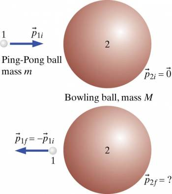

In an orbiting spacecraft a Ping-Pong ball of mass m (object 1) traveling in the +x direction with initial momentum ${\overset{\rightarrow}{p}}_{1i}$ hits a stationary bowling ball of mass M (object 2) head on, as shown in the figure in representations.

What are the

\[a\] momentum?

\[b\] speed?

\[c\] kinetic energy?

Of each object after the collision.

## Facts

Situation occurring in an orbiting spacecraft.

Ping-Pong ball of mass m with initial momentum ${\overset{\rightarrow}{p}}_{1i}$ traveling in the +x direction.

Bowling ball of mass M is hit by the Ping-Pong ball while stationary.

Initial situation: Just before collision

Final situation: Just after collision

## Lacking

What are the

\[a\] momentum?

\[b\] speed?

\[c\] kinetic energy?

Of each object after the collision.

## Approximations & Assumptions

Assume little change in the speed of the Ping-Pong ball, and assume that the collision is elastic.

## Representations

System: Ping-Pong ball and bowling ball

Surroundings: Nothing that exerts significant forces

${\overset{\rightarrow}{p}}_{1f} + {\overset{\rightarrow}{p}}_{2f} = {\overset{\rightarrow}{p}}_{1i} + {\overset{\rightarrow}{p}}_{2i}$​

$K = \frac{1}{2}(\frac{p^{2}}{m})$​

## Solution

From the momentum principle:

$$
{\overset{\rightarrow}{p}}_{1f} + {\overset{\rightarrow}{p}}_{2f} = {\overset{\rightarrow}{p}}_{1i} + {\overset{\rightarrow}{p}}_{2i}
$$

Assume that the speed of the Ping-Pong ball does not change significantly in the collision, so ${\overset{\rightarrow}{p}}_{1f} \approx - {\overset{\rightarrow}{p}}_{1i}$.

$$
- {\overset{\rightarrow}{p}}_{1i} + {\overset{\rightarrow}{p}}_{2f} = {\overset{\rightarrow}{p}}_{1i}
$$

Add like terms and rearrange:

$$
{\overset{\rightarrow}{p}}_{2f} = 2{\overset{\rightarrow}{p}}_{1i}
$$

\[a\] The final momentum of the bowling ball is twice the initial momentum of the Ping-Pong ball.

It may be surprising that the bowling ball ends up with about twice the momentum of the Ping-Pong ball. One way to understand this is that the final momentum of the Ping-Pong ball is approximately $- {\overset{\rightarrow}{p}}_{1i}$, so the change in the Ping-Pong ball's momentum is approximately

$- {\overset{\rightarrow}{p}}_{1i} - {\overset{\rightarrow}{p}}_{1i} = - 2{\overset{\rightarrow}{p}}_{1i}$​

The Ping-Pong ball's speed hardly changed, but its momentum changed a great deal. Because momentum is a vector, a change of direction is just as much a change of magnitude. This big change is of course due to the interatomic electric contact forces exerted on the Ping-Pong ball by the bowling ball. By reciprocity, the same magnitude of interatomic contact forces are exerted by the Ping-Pong ball on the bowling ball, which undergoes a momentum change of $+ 2{\overset{\rightarrow}{p}}_{1i}$

\[b\] Final speed of bowling ball:

From the equation for momentum: $p_{2f} = M(v_{2f})$

Therefore:

$$
{\overset{\rightarrow}{v}}_{2f} \approx \frac{p_{2f}}{M}
$$

Substitute $2{\overset{\rightarrow}{p}}_{1i}$ in for $p_{2f}$ from previous result in this example above.

$$
{\overset{\rightarrow}{v}}_{2f} \approx \frac{2p_{1i}}{M}
$$

Momentum is mass times velocity so substitute this in:

$$
{\overset{\rightarrow}{v}}_{2f} \approx \frac{2mv_{1i}}{M}
$$

Rearrange:

$$
{\overset{\rightarrow}{v}}_{2f} \approx \frac{m}{M})v_{1i}
$$

This is a very small speed since m«M/ For example, if the mass of the bowling ball is about 5 kg, and the gram Ping-Pong ball is initially traveling at 10 m/s, the final speed of the bowling ball will be 0.008 m/s.

\[c\] Kinetic energies:

From our representations we know that $K = \frac{1}{2}(\frac{p^{2}}{m})$

But we also know that $p_{2f} = 2{\overset{\rightarrow}{p}}_{1i}$ from earlier so substituting this into $K = \frac{1}{2}(\frac{p^{2}}{m})$ we get this equation for the final kinetic energy of the bowling ball

$$
K_{2f} = \frac{(2p_{1i})^{2}}{2M}
$$

and the equation for the final kinetic energy of the Ping-Pong ball is

$$
K_{1f} = \frac{p_{1i}^{2}}{2m}
$$

As we assumed that the speed of the Ping-Pong ball does not change significantly after the collision.

Because the mass of the bowling ball is much larger than the mass of the Ping-Pong ball, the kinetic energy of the bowling ball is much smaller than the kinetic energy of the Ping-Pong ball. The kinetic energy of the 2g Ping-Pong ball, traveling at 10m/s, is about 0.1J, while the 5kg bowling ball has acquired a kinetic energy of $1.6 \times 10^{- 4}J$ - nearly 1000 times less.
