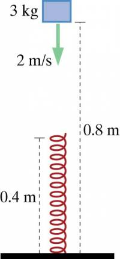

A metal block of mass 3 kg is moving downward with speed 2 m/s when the bottom of the block is 0.8 m above the floor. When the bottom of the block is 0.4m above the floor, it strikes the top of a relaxed vertical spring 0.4 m in length. The stiffness of the spring is 2000 N/m.

a: The block continues downward, compressing the spring. When the bottom of the block is 0.3m above the floor, what is its speed?

b: The block eventually heads back upward, loses contact with the spring, and continues upward. What is the maximum height reached by the bottom of the block above the floor?

c: What approximations did you make?

## Facts

Metal block of mass 3 kg

The stiffness of the spring is 2000 N/m.

The block has the following initial conditions for both parts:

a:

Initial State: Block 0.8 m above floor, moving downward, $v_{i}$ = 2 m/s, spring relaxed

Final State: Block 0.3 m above floor, spring compressed

b:

Initial State: Block 0.8 m above floor, moving downward, $v_{i}$ = 2 m/s, spring relaxed

Final State: Block at highest point, $v_{f} = 0$, spring relaxed

## Lacking

a: The speed of the block when it is 0.3 m above the floor

b: The maximum height

## Approximations & Assumptions

Air resistance and dissipation in the spring are negligible.

$U_{g} \approx mgy$ near Earth's surface.

$\Delta K_{Earth}$ is negligible.

## Representations

System: Earth, block, spring

Surroundings: Nothing significant

Energy Principle: $E_{f} = E_{i} + W$

$K = \frac{1}{2}mv^{2}$​

$U_{spring} = \frac{1}{2}k_{s}s^{2}$​

$U_{gravitational} = mgy$​

## Solution

a:

From the Energy Principle:

$E_{f} = E_{i} + W$​

The total final energy is the sum of the kinetic energy, spring potential energy and gravitational potential energy which is equal to the total initial energy which is the sum of the kinetic energy, spring potential energy and gravitational potential energy initially.

$K_{f} + U_{s,f} + U_{g,f} = K_{i} + U_{s,i} + U_{g,i} + W$​

The work is equal to zero as no work is being done by the surroundings since the system is the Earth, block and spring.

$U_{s,i}$ is also equal to zero as there is no initial spring potential energy as the spring is not compressed.

We then substitute in the equations for kinetic and potential energies.

$\frac{1}{2}mv_{f}^{2} + mgy_{f} + \frac{1}{2}k_{s}s_{f}^{2} = mgy_{i} + \frac{1}{2}mv_{i}^{2}$​

Multiply across by 2 and divide across by m in order to simplify the equation. Also group like terms.

$v_{f}^{2} = v_{i}^{2} + 2g(y_{i} - y_{f}) - \frac{k_{s}}{m}s_{f}^{2}$​

Isolate $v_{f}$ to solve for it:

$v_{f} = \sqrt{(2m/s)^{2} + 2(9.8N/kg)(0.5m) - \frac{2000N/m}{3kg}{(0.1m)}^{2}}$​

$v_{f} = 2.7m/s$​

b:

We want to find the value for $y_{f}$ which is the maximum height reached by the bottom of the block above the floor.

From the Energy Principle:

$E_{f} = E_{i} + W$​

The total final energy is the sum of the kinetic energy, spring potential energy and gravitational potential energy which is equal to the total initial energy which is the sum of the kinetic energy, spring potential energy and gravitational potential energy initially.

$K_{f} + U_{s,f} + U_{g,f} = K_{i} + U_{s,i} + U_{g,i} + W$​

The work is equal to zero as no work is being done by the surroundings since the system is the Earth, block and spring.

$U_{s,i}$ and $U_{s,f}$ are both equal to zero as there is no initial spring potential energy or final spring potential energy as the spring is not compressed in either case.

$K_{f}$ is also equal to zero as the maximum height is reached when the block has a final kinetic energy of zero.

Substitute in equations for kinetic and potential energy for remaining terms.

$mgy_{f} = mgy_{i} + \frac{1}{2}mv_{i}^{2}$​

Divide each term by mg.

$y_{f} = y_{i} + \frac{v_{i}^{2}}{2g}$​

Solve for $y_{f}$

$(0.8m) + \frac{(2m/s)^{2}}{2(9.8N/kg)} = 1.0m$​
