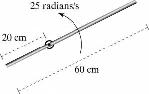

A thin rod with mass 140 grams and 60 cm long rotates at an angular speed of 25 radians/s about an axle that is 20cm from one end of the rod (see Figure in Representations). What is its kinetic energy?

## Facts

Thin rod has a mass of 140 grams

Thin rod is 60 cm long

Thin rod rotates at an angular speed of 25 radians/s

Rotation occurs around an axle that is 20cm from one end of the rod

## Assumptions and Approximations

The rod has to be sufficiently thin so your not worried about contributions to moment of inertia from parts that are far away.

## Lacking

What is the kinetic energy of the rod?

## Representations

$K_{tot} = K_{trans} + K_{rot} = \frac{1}{2}(Mr_{CM}^{2} + I_{CM})\omega^{2}$​

$K_{trans} = \frac{1}{2}Mr_{CM}^{2}$​

$K_{rot} = \frac{1}{2}I_{CM}\omega^{2}$​

$I = (\frac{1}{12})ML^{2}$ for a thin rod

## Solution

There is translational kinetic energy because the center of mass is moving, and there is rotational energy because there is rotation about the center of mass.

We know that $(r_{CM} = 0.1m):$ because this the distance to the centre of mass from the point of rotation: (30cm - 20cm).

We are looking for the kinetic energy for a rigid body rotating about a point not the center of the mass.

The total energy has both translational and rotational components

$K_{tot} = K_{trans} + K_{rot}$​

Substitute in equations for rotational kinetic energy and translational kinetic energy

$K_{tot} = \frac{1}{2}(Mr_{CM}^{2} + I_{CM})\omega^{2}$​

Substitute in $(\frac{1}{12})ML^{2}$ for L as we are dealing with the inertia for a thin rod.

$K_{tot} = \frac{1}{2}(Mr_{CM}^{2}\mspace{6mu} + \mspace{6mu}\frac{1}{12}ML^{2})\omega^{2}$​

Gather the M's out of both equations so that your equation now looks like:

$K_{tot} = \frac{1}{2}M(r_{CM}^{2}\mspace{6mu} + \mspace{6mu}\frac{1}{12}L^{2})\omega^{2}$​

Insert values for the corresponding variables.

$K_{tot} = \frac{1}{2}(.140\mspace{6mu} kg)((.1m^{2}) + \frac{1}{12}(.6m)^{2})(25\mspace{6mu} radians/s)^{2}$​

Solve for $K_{tot}$

$K_{tot} = 1.75J$​
