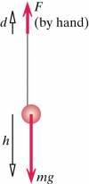
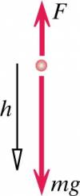

You're playing with a yo-yo of mass m on a low-mass string (See Diagram in Representations). You pull up on the string with a force of magnitude F, and your hand moves up a distance d. During this time the mass falls a distance h (and some of the string reels off the yo-yo's axle).

\(a\) What is the change in translational kinetic energy of the yo-yo?

\(b\) What is the change in the rotational kinetic energy of the yo-yo, which spins faster?

## Facts

a:

Initial State: Point particle with initial translational kinetic energy

Final State: Point particle with final translational kinetic energy

b:

Initial State: Initial rotational and translational kinetic energy

Final State: Final rotational and translational kinetic energy

## Assumptions and Approximations

You are able to maintain constant force when pulling up on yo-yo

Assume no slipping of string around the axle. Spindle turns the same amount as string that has unravelled

No wobble included

String has no mass

## Lacking

Change in translational kinetic energy of the yo-yo

Change in the rotational kinetic energy of the yo-yo

## Representations

a:

Point Particle System

System: Point particle of mass $m$

Surroundings: Earth and hand

b:

Real system

System: Mass and string

Surroundings: Earth and hand

$\Delta K_{trans}$ = $\int_{i}^{f}{\overset{\rightarrow}{F}}_{net} \cdot d{\overset{\rightarrow}{r}}_{cm}$

$\Delta E_{sys}$ = $W_{surr}$

## Solution

a:

From the Energy Principle ( when dealing with a point particle it only has $K_{trans}$):

$\Delta K_{trans}$ = $\int_{i}^{f}{\overset{\rightarrow}{F}}_{net} \cdot d{\overset{\rightarrow}{r}}_{cm}$

Substituting in for the forces acting on the yo-yo for $F_{net}$ and the change in position in the y direction for the centre of mass for $d{\overset{\rightarrow}{r}}_{cm}$ we get:

$\Delta K_{trans} = (F - mg)\Delta y_{CM}$​

As indicated in diagram in the b section of the representation:

$\Delta y_{CM} = - h$​

Substitute in $- h$ for $y_{CM}$

$\Delta K_{trans} = (F - mg)( - h)$​

Multiply across by a minus and you get an equation for $\Delta K_{trans}$ that looks like:

$\Delta K_{trans} = (mg - F)h$​

b:

From the energy principle we know:

$\Delta E_{sys}$ = $W_{surr}$

In this case we know that the change in energy in the system is due to the work done by the hand and the work done by the Earth.

$\Delta E_{sys} = W_{hand} + W_{Earth}$​

Because we are dealing with the real system in this scenario the change in energy is equal to the change in translational kinetic energy + the change in rotational kinetic energy.

$\Delta K_{trans} + \Delta K_{rot} = W_{hand} + W_{Earth}$​

Substitute in the work represented by force by distance for both the hand and the Earth.

$\Delta K_{trans} + \Delta K_{rot} = Fd + ( - mg)( - h)$​

From part (a) of the problem we can substitute in $(mg - F)h$ for $\Delta K_{trans}$ as the translational kinetic energy will be the same.

$\Delta K_{trans} = (mg - F)h$​

Substituting this into our equation leaves us with:

$(mg - F)h + \Delta K_{rot} = Fd + mgh$​

Solve for change in rotational kinetic energy:

$\Delta K_{rot} = F(d + h)$​
