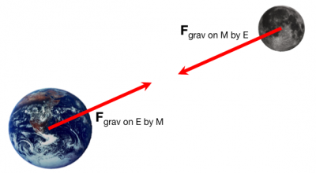

At a particular moment in time the Moon is located $\langle 1.9 \times 10^{8},0, - 1.9 \times 10^{8}\rangle$ m in a coordinate system in which the origin is located at the center of the Earth.

Determine the gravitational force exerted by the Earth on the Moon.

### Facts

- The relative position vector from the Earth to the Moon is $\langle 1.9 \times 10^{8},0, - 1.9 \times 10^{8}\rangle$ m
- Earth is origin of coordinate system $\langle 0,0,0\rangle$ m
- G, the gravitational constant = $6.7 \times 10^{- 11}Nm^{2}/kg^{2}$

### Lacking

- The mass of the Earth is not given but can be [found online](http://lmgtfy.com/?q=mass+of+the+earth) ($5.9 \times 10^{24}kg$)
- The mass of the Moon is not given but can be [found online](http://lmgtfy.com/?q=mass+of+the+moon) ($7.3 \times 10^{22}kg$)

### Approximations & Assumptions

- Assume no other forces acting on the moon.

### Representations

- Gravitational Force: ${\overset{\rightarrow}{F}}_{grav} = - G\frac{M_{E}\, M_{m}}{|\overset{\rightarrow}{r}|^{2}}\widehat{r}$

## Solution

In order to find the gravitational force we must first calculate the center to center distance between the moon and the earth

$$
|{\overset{\rightarrow}{r}}_{M - E}| = \sqrt{(r_{M - E_{x}})^{2} + (r_{M - E_{y}})^{2} + (r_{M - E_{z}})^{2}}
$$

$$
= \sqrt{(1.9 \times 10^{8}m)^{2} + (0m)^{2} + ( - 1.9 \times 10^{8}m)^{2}}
$$

$$
= 2.7x10^{8}m
$$

We also must find the direction of this force. The direction of the force will be in the same direction as the radius vector. We can find the direction of a vector by computing the unit vector of ${\overset{\rightarrow}{r}}_{M - E}$

$$
{\widehat{r}}_{M - E} = \frac{{\overset{\rightarrow}{r}}_{M - E}}{|{\overset{\rightarrow}{r}}_{M - E}|}
$$

$$
= \frac{\langle 1.9 \times 10^{8},0, - 1.9 \times 10^{8}\rangle m}{2.7 \times 10^{8}m}
$$

$$
= \langle 0.7,0, - 0.7\rangle
$$

Adding both the direction of the radius and the length of the radius to the mass of the Earth and the mass of the Moon and the gravitational constant we now have all of the variables needed to compute the gravitational force exerted by the Earth on the Moon. The force between the Earth and the moon is the same as the gravitational force exerted by the Earth on the Moon.

$$
{\overset{\rightarrow}{F}}_{M - E} = {\overset{\rightarrow}{F}}_{grav\, on\, M\, by\, E}
$$

This is the representation we identified for gravitational force. There is a minus in front of the G as the direction of the gravitational force is opposite to the direction of the unit vector $\widehat{r}$, which points from object 1 (Moon) to object 2(Earth).

$$
= - G\frac{m_{M}m_{E}}{|{\overset{\rightarrow}{r}}_{M - E}|^{2}}{\widehat{r}}_{M - E}
$$

Input all the values identified for the various variables.

$$
= (6.7 \times 10^{- 11}Nm^{2}/kg^{2})\frac{(7.3 \times 10^{22}kg)(5.9 \times 10^{24}kg)}{(2.7 \times 10^{8}m)^{2}}\langle - 0.7,0, + 0.7\rangle
$$

Results in the magnitude of the force by unit vector (direction).

$$
= 4.0 \times 10^{20}N\langle - 0.7,0, + 0.7\rangle
$$

Results in the vector force, with the x,y,z components interpretable.

$$
= \langle - 2.8 \times 10^{20},0,2.8 \times 10^{20}\rangle N
$$
