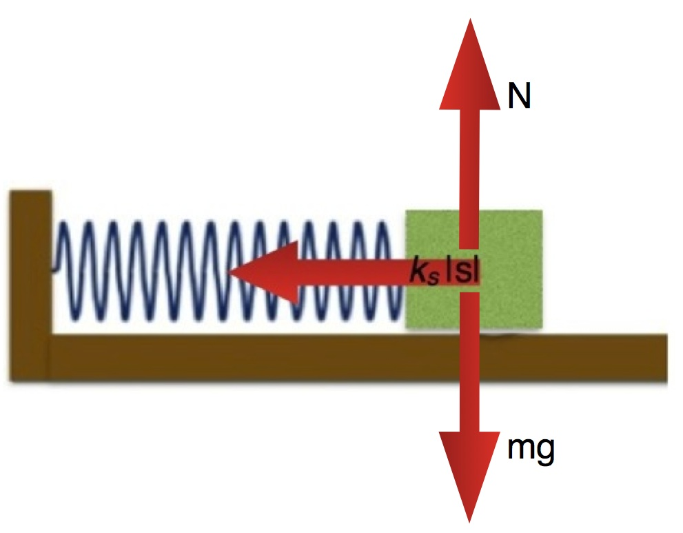
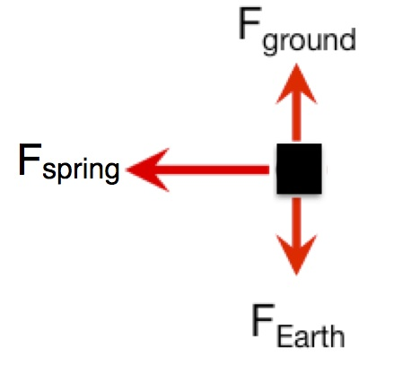

A spring with a mass block at the end of it and with a stiffness of 8 $N/m$ and a relaxed length of 20 $cm$ is attached to a chamber wall that results in its oscillations being horizontal. At a particular time the location of the block mass is $\langle.38,0,0\rangle\, m$ relative to an origin point where the spring is attached to the chamber wall. Determine the force exerted by the spring on the mass at this instant.

### Facts

- Spring has relaxed length of 0.2m, $L_{0} = 0.2\, m$
- Spring has spring constant of $8N/m$, $k_{s} = 8\, N/m$
- At the moment of interest, the mass block is at position $\overset{\rightarrow}{L} = \langle.38,0,0\rangle m$
- The net force acting on system is due to spring force (the gravitational force exerted by the Earth has the same magnitude as the force exerted by the horizontal surface)

### Lacking

- The force that the spring exerts

### Approximations & Assumptions

- Origin is at chamber wall $\langle 0,0,0\rangle\, m$
- Assume no forces due to drag or to friction

### Representations

${\overset{\rightarrow}{F}}_{spring} = - k_{s}\overset{\rightarrow}{s}$​

$|\overset{\rightarrow}{s}| = |L - L_{0}|$​

## Solution

To determine the spring force, you will need to compute:

$$
{\overset{\rightarrow}{F}}_{spring} = - k_{s}\overset{\rightarrow}{s} = - k_{s}|\overset{\rightarrow}{s}|\widehat{s}
$$

You will start be determining the position vector ($\overset{\rightarrow}{L}$) of the mass and the length of the position vector ($|\overset{\rightarrow}{L}|$),

$$
\overset{\rightarrow}{L} = \langle 0.38,0,0\rangle m - \langle 0,0,0\rangle m = \langle 0.38,0,0\rangle m
$$

$$
|\overset{\rightarrow}{L}| = 0.38m
$$

These can be used to compute the unit (direction) vector for the stretch ($\widehat{s}$), which is in the same direction as the position vector:

$$
\widehat{s} = \widehat{L} = \frac{\langle 0.38,0,0\rangle}{0.38} = \langle 1,0,0\rangle
$$

You can then compute the magnitude of the stretch $(|\overset{\rightarrow}{s}|)$:

$$
|\overset{\rightarrow}{s}| = |L - L_{0}| = 0.38m - 0.20m = 0.18m
$$

Finally, you can compute the force:

$$
\overset{\rightarrow}{F} = - k_{s}|\overset{\rightarrow}{s}|\widehat{s} = - (8N/m)(0.18m)\langle 1,0,0\rangle = \langle - 1.44,0,0\rangle\, N
$$

which points to the left. That is consistent with the diagram above.
