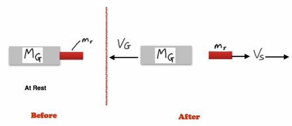

How much force does a 12 gauge exert on your shoulder when firing a deer slug?

## Facts

Mass of gun = 3.5kg

Mass of slug = 0.22kg

## Lacking

${\overset{\rightarrow}{F}}_{net}$ on shoulder

## Approximations & Assumptions

$\Delta t \rightarrow 1/24s$ - Based on when a gun is fired in a movie, it usually occurs at about one movie frame, therefore, the collision time is less than 1/24s.

${\overset{\rightarrow}{V}}_{Slug} \rightarrow 500m/s$ This is a conservative estimate based on an internet search.

## Representations

System: Gun + Slug

Surroundings: Nothing

${\overset{\rightarrow}{F}}_{net} = \frac{\Delta\overset{\rightarrow}{p}}{\Delta t}$​

${\overset{\rightarrow}{p}}_{sys,f} = {\overset{\rightarrow}{p}}_{sys,i}$​

${\overset{\rightarrow}{p}}_{1,f} + {\overset{\rightarrow}{p}}_{2,f} = {\overset{\rightarrow}{p}}_{1,i} + {\overset{\rightarrow}{p}}_{2,i}$​

$m_{1}{\overset{\rightarrow}{v}}_{1,f} + m_{2}{\overset{\rightarrow}{v}}_{2,f} = m_{1}{\overset{\rightarrow}{v}}_{1,i} + m_{2}{\overset{\rightarrow}{v}}_{2,i}$​

## Solution

We know that the momentum of the system (gun + slug) does not change due to their being no external forces acting on the system, therefore, the change in momentum in the x-direction is 0.

$\Delta p_{x} = 0$​

The total momentum of the system in x direction is also 0.

$P_{tot,x} = 0$​

This is because the initial momentum of the system is 0 and therefore the final momentum of the system is zero.

$P_{tot,i,x} = 0$​

We can relate the momentum before to the momentum after then giving us the following equation.

$0 = M_{G}*V_{G} + m_{S}*V_{S} \rightarrow M_{G}*V_{G}$ is negative and $m_{S}*V_{S}$ is positive (see diagram).

To find the force acting on the shoulder of the shooter me need to know $V_{G}$ in order to find change in momentum for the gun and relate this to the force using ${\overset{\rightarrow}{F}}_{net} = \frac{\Delta\overset{\rightarrow}{p}}{\Delta t}$. Rearrange the previous equation.

$V_{G} = \frac{- m_{s}}{M_{G}}V_{S}$​

Fill in the values for the corresponding variables.

$V_{G} = - \frac{0.22kg}{3.5kg}500m/s = - 31.4m/s$​

Use the value found for $V_{G}$ to find the change in momentum and hence find what kind of force that is on your shoulder.

${\overset{\rightarrow}{F}}_{net} = \frac{\Delta\overset{\rightarrow}{p}}{\Delta t}$​

Fill in values for known variables.

${\overset{\rightarrow}{F}}_{net} = \frac{(3.5kg)( - 31.4m/s + 0m/s)}{(1/24s)}$​

${\overset{\rightarrow}{F}}_{net} = 2637.6N$ (at least)
