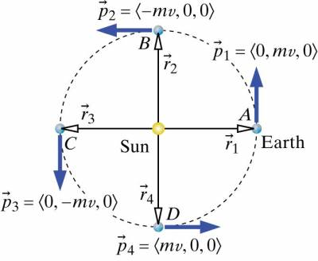

Calculate the magnitude of the Earth's translational (orbital) angular momentum relative to the Sun when the Earth is at location A and when the Earth is at location B as displayed in the representation of the situation in the representations. The mass of the Earth is $6$ x $10^{24}kg$ and its distance from the Sun is $1.5$ x $10^{11}m$.

## Facts

Mass of the Earth: $6$ X $10^{24}$kg

Distance from the Sun: $1.5$ x $10^{11}$m

## Lacking

The magnitude of the Earth's translational (orbital) angular momentum relative to the Sun when the Earth is at location A on the representation and when it is at location B on the representation.

## Approximations & Assumptions

Assume Earth moves in a perfect circular orbit

Assume main interaction is with the sun

## Representations

Circumference of a circle = $2\pi r$

$\overset{\rightarrow}{p} = m\overset{\rightarrow}{v}$​

$v = s/t$​

$\left| {\overset{\rightarrow}{L}}_{trans} \right| = \left| {\overset{\rightarrow}{r}}_{A} \right|\left| \overset{\rightarrow}{p} \right|\sin\theta$​

## Solution

The Earth makes one complete orbit of the Sun in 1 year, so you need to break down 1 year into seconds and know that the distance the Earth travels in that time is $2\pi r$ in order to find its average speed is:

$v = \frac{2\pi(1.5 \times 10^{11}m)}{(365)(24)(60)(60)s} = 3.0 \times 10^{4}m/s$​

With this average velocity we can find the momentum of Earth at location A as we know the mass of the Earth and now know the velocity of the Earth.

$\overset{\rightarrow}{p} = \langle 0,6 \times 10^{24}kg \cdot 3.0 \times 10^{4}m/s,0\rangle$​

Computing for momentum we get:

$\overset{\rightarrow}{p} = \langle 0,1.8 \times 10^{29},0\rangle kg \cdot m/s$​

$\mid \overset{\rightarrow}{p} \mid = 1.8 \times 10^{29}kg \cdot m/s$​

We know that the magnitude of the Earth's translational angular momentum relative to the sun is given by $\left| {\overset{\rightarrow}{L}}_{trans,Sun} \right| = \left| {\overset{\rightarrow}{r}}_{A} \right|\left| \overset{\rightarrow}{p} \right|\sin\theta$

$\mid {\overset{\rightarrow}{L}}_{trans,Sun} \mid = (1.5 \times 10^{11}m)(1.8 \times 10^{29}kg \cdot m/s)sin90^{\circ}$​

Compute for $\left| {\overset{\rightarrow}{L}}_{trans,Sun} \right|$ by inputting the known values for the variables.

$\mid {\overset{\rightarrow}{L}}_{trans,Sun} \mid = 2.7 \times 10^{40}kg \cdot m^{2}/s$​

It turns out that at location $B, \mid \overset{\rightarrow}{r} \mid , \mid \overset{\rightarrow}{p} \mid$, and $\theta$ are the same as they were at location A, so $\mid {\overset{\rightarrow}{L}}_{trans,Sun} \mid$ also has the same value it had at location A.
