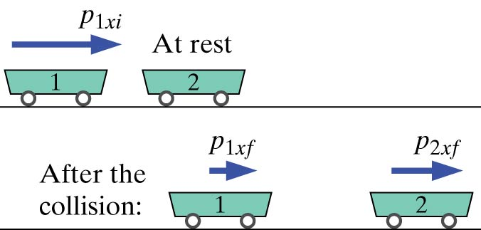

Cart 1 collides with stationary cart 2, which is identical. Suppose that the collision is (nearly) elastic, as it will be if the carts repel each other magnetically or interact through soft springs. In this case there is no change of internal energy. What are the final momenta of the two carts?

## Facts

Cart 1 collides with Cart 2

Initial situation: Just before collision

Final situation: Just after collision

## Lacking

Final momenta of the two carts

## Approximations & Assumptions

Assume collision is elastic

Assume there is no change of internal energy

Neglect friction and air resistance - negligible effect of surroundings - only x components change

## Representations

System: Both carts

Surroundings: Earth, track, air

${\overset{\rightarrow}{p}}_{f} = {\overset{\rightarrow}{p}}_{i} + {\overset{\rightarrow}{F}}_{net}\Delta t$​

$E_{f} = E_{i} + W + Q$​

$K = \frac{1}{2}mv^{2} = \frac{1}{2}m(\frac{p}{m})^{2} = \frac{1}{2}(\frac{p^{2}}{m})$​

## Solution

Since the y and z components of momentum don't change, we can work with only x components

From the momentum principle we know:

$$
{\overset{\rightarrow}{p}}_{f} = {\overset{\rightarrow}{p}}_{i} + {\overset{\rightarrow}{F}}_{net}\Delta t
$$

There is not net force so this term cancels out:

$$
{\overset{\rightarrow}{p}}_{f} = {\overset{\rightarrow}{p}}_{i}
$$

The momentum of carts afterwards is equal to the momentum of the carts before hand:

$$
{\overset{\rightarrow}{p}}_{1xf} + {\overset{\rightarrow}{p}}_{2xf} = {\overset{\rightarrow}{p}}_{1xi} + 0
$$

From the energy principle we also know that:

$$
E_{f} = E_{i} + W + Q
$$

But there is no work done on the system and no thermal energy transfer due to an energy difference either.

$$
E_{f} = E_{i}
$$

Which gives us the following equation consisting of the kinetic energy plus the internal energy of the system before is equal to the kinetic energy and the internal energy of the system after.

$$
K_{1f} + K_{2f} + E_{int1f} + E_{int2f} = K_{1i} + K_{2i} + E_{int1i} + E_{int2i}
$$

Since the internal energies before and after do not change and since the initial velocity of cart 2 is zero the equation simplifies down to:

$$
K_{1f} + K_{2f} = K_{1i}
$$

By combining the momentum and energy equations together $(K = \frac{1}{2}m(\frac{p^{2}}{m})$ we get:

$$
\frac{p_{1xf}^{2}}{2m} + \frac{p_{2xf}^{2}}{2m} = \frac{(p_{1xf} + p_{2xf})^{2}}{2m}
$$

Cancel out the denominator of 2m:

$$
p_{1xf}^{2} + p_{2xf}^{2} = p_{1xf}^{2} + 2p_{1xf}p_{2xf} + p_{2xf}^{2}
$$

Cancel like terms and you get:

$$
2p_{1xf}p_{2xf} = 0
$$

There are two possible solutions to this equation. The term $p_{1xf}p_{2xf}$ can be zero if $p_{1xf} = 0$ or if $p_{2xf} = 0$.
