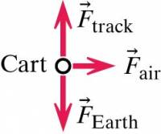

The fan cart in the video below is observed to [accelerate](/pcubed/notes/week-02-modeling-motion-net-force/acceleration/) uniformly to the right. The air exerts a [constant force](/pcubed/notes/week-02-modeling-motion-net-force/constantf/) on the blades that is around $0.45N$. Determine the how far the fan cart has traveled after $2.2s$ if the cart starts from rest.

### Facts

- The fan cart accelerates uniformly to the right.
- The force by the air on the blades if $0.45N$.
- The fan cart travels to the right for $2.2s$.
- The fan cart starts from rest.
- The fan cart experiences several forces including:
  - the force of the air on the blades (to the right)
  - the gravitational force due to the interaction with the Earth (directly downward)
  - the force applied by the track (directly upward)
  - a frictional forces and air resistance that resist the motion
- The acceleration due to gravity is 9.8 $\frac{m}{s^{2}}$ and is directed downward.

### Lacking

- The mass of the fan cart is not given, but can be [found online](http://lmgtfy.com/?q=mass+of+a+pasco+fan+cart) ($m_{cart} = 0.3kg$).

### Approximations & Assumptions

- Over the interval that we care about it, we will assume the net force doesn't change. That is, the cart experiences [constant force motion](/pcubed/notes/week-02-modeling-motion-net-force/constantf/).
- As a result, the motion occurs only in the horizontal direction.

### Representations

- The forces acting on the fan cart (the system's interactions with its surroundings) are represented in this free-body diagram.

- The net force acting on the fan cart is the sum of all the forces, ${\overset{\rightarrow}{F}}_{net} = \sum{\overset{\rightarrow}{F}}_{i} = \langle 0.45,0,0\rangle N$.
- The displacement of the fan cart in the $x$-direction can be written like this: $x_{f} - x_{i} = v_{xi}\Delta t + \frac{1}{2}\frac{F_{net,x}}{m}\Delta t^{2}$

## Solution

The displacement of the cart is given by,

$\Delta x_{cart} = x_{cart,f} - x_{cart,i} = v_{cart,xi}\Delta t + \frac{1}{2}\frac{F_{net,x}}{m_{cart}}\Delta t^{2}$​

We can compute this displacement,

$$
\Delta x_{cart} = (0\frac{m}{s})(2.2s) + \frac{1}{2}\frac{0.45N}{0.3kg}(2.2s)^{2} = 3.6m
$$
