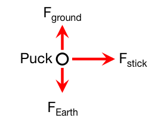

[Henrik Zetterberg](http://en.wikipedia.org/wiki/Henrik_Zetterberg) is passing a hockey puck at a Red Wings practice. From video of the pass, you can determine the stick was in contact with the puck for $0.05s$. You estimate the force with which “Zäta” passes the puck is about a tenth of his weight, so $100N$. Determine how fast the puck leaves Zäta's stick.

### Facts

- The puck experiences several forces including
  - the gravitational force (directly downward)
  - the force of the stick
  - the force due to the ice (upward)
  - some frictional forces and air resistance

### Lacking

- The mass of an NHL regulation hockey puck is unknown but can be [found online](http://lmgtfy.com/?q=mass+of+a+regulation+NHL+hockey+puck) ($m_{puck} = 0.17kg$).

### Approximations & Assumptions

- Over the time interval the puck is in contact with the stick, the frictional forces are negligible.
- The puck is contact with the stick for $0.05s$.
- The force the stick exerts on the puck is roughly constant over the $0.05s$ time interval.
- The force the stick exerts is $100N$, and can be considered to act in a single direction.
- The puck starts from rest.

### Representations

- The free-body diagram for this situation is given by the diagram below.

- The final momentum of the puck is given by the update form of the [Momentum Principle](/pcubed/notes/week-02-modeling-motion-net-force/momentum_principle/): ${\overset{\rightarrow}{p}}_{f} = {\overset{\rightarrow}{p}}_{i} + {\overset{\rightarrow}{F}}_{net}\Delta t$.

## Solution

Given the approximations and assumptions above, you can write the update form of the momentum principle for this question,

$$
{\overset{\rightarrow}{p}}_{f} = m_{puck}{\overset{\rightarrow}{v}}_{f} = {\overset{\rightarrow}{F}}_{net}\Delta t
$$

because the puck starts from rest. So that,

$$
{\overset{\rightarrow}{v}}_{f} = \frac{{\overset{\rightarrow}{F}}_{net}}{m_{puck}}\Delta t
$$

which we can consider in one dimension,

$$
v_{f} = \frac{F_{net}}{m_{puck}}\Delta t = \frac{100N}{0.17kg}(0.05s) = 29.4\frac{m}{s}
$$
