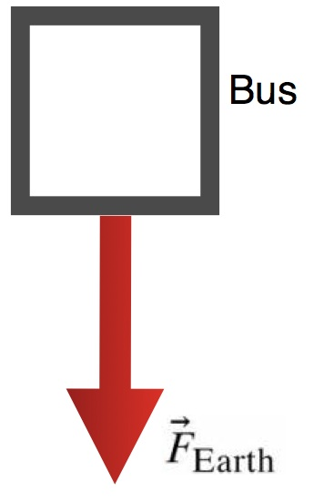

An out of control bus is forced to jump from a location $\langle 0,40, - 5\rangle$m with an initial velocity of $\langle 80,7, - 5\rangle$m. Determine the time at which the bus hits the ground.

### Facts

- Starting position of the bus $\langle 0,40, - 5\rangle$m
- Initial velocity of the bus $\langle 80,7, - 5\rangle$m
- The acceleration due to gravity is 9.8 $\frac{m}{s^{2}}$ and is directed downward.
- The bus experiences one force - the gravitational force (directly down).

### Lacking

- The time the bus hits the ground.

### Approximations & Assumptions

- Assume no drag effects
- Assume ground is when position of bus is 0 in the y direction

### Representations

Diagram of forces acting on bus once it leaves the road.

General equation for position up date formula for constant force systems:

$$
{\overset{\rightarrow}{r}}_{f} = {\overset{\rightarrow}{r}}_{i} + {\overset{\rightarrow}{v}}_{i}\Delta t + \frac{1}{2}\frac{{\overset{\rightarrow}{F}}_{net}}{m}\Delta t^{2}
$$

Equation for determining $\Delta t$ in constant force situations.

## Solution

In this problem we know the only force acting on the bus is the force due to gravity which acts solely in the y-direction.

The bus has an initial velocity in the x-direction of $80m/s^{- 1}$ but with no forces acting in the x-direction this velocity will remain constant.

This x-velocity has no effect on the amount of time it takes for the bus to reach the ground. Just as the z-velocity does not either.

The force due to gravity is constant so we can use the equation for position up date formula for constant force systems.

We know the final position of the bus is the ground where the y-component of the position vector is 0.

We know the bus is accelerating towards the ground at $- 9.8ms^{- 2}$ due to the net force in the y-direction being the acceleration due to the force of gravity.

Since we are concerned only with the y-component of the motion we can use the y-component version of the position update equation:

$y_{f} - y_{i} = v_{iy}\Delta t + \frac{1}{2}\frac{F_{net,y}}{m}\Delta t^{2}$​

At ground $y_{f} = 0$; the bus initially leaves the road at $y_{i} = 40$.

$0 - 40 = v_{iy}\Delta t + \frac{1}{2}\frac{- mg}{m}\Delta t^{2}$​

The masses cancel.

$- 40 = v_{iy}\Delta t + - \frac{1}{2}g\Delta t^{2}$​

Rearrange the equation.

$- 40 - v_{iy}\Delta t = - \frac{1}{2}g\Delta t^{2}$​

Sub in values for $v_{iy}$ and $g$

$- 40 - (7\Delta t) = - 4.9\Delta t^{2}$​

Solve the quadratic equation

$\Delta t = 3.65s$​
