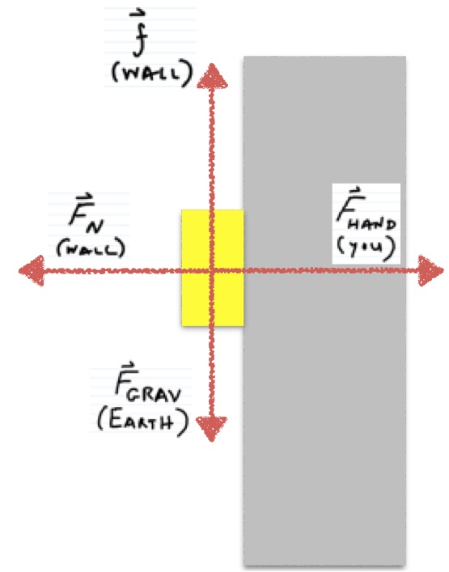

You hold a 3 kg metal block against a wall by applying a horizontal force of 40 N, as shown in the figure in representations. The coefficient of friction for the metal-wall pair of materials is 0.6 for both static friction and sliding friction. Does the block slip down the wall?

### Facts

The metal block has a mass of 3 kg

Horizontal force applied to metal block of 40N in positive x-direction

Coefficient of friction for the metal-wall pair of materials is 0.6 for both static and sliding friction.

### Lacking

${\overset{\rightarrow}{F}}_{net}$ in the x-direction

${\overset{\rightarrow}{F}}_{net}$ in the y-direction

### Approximations & Assumptions

Assume applied horizontal force is constant.

### Representations

$\Delta\overset{\rightarrow}{p} = {\overset{\rightarrow}{F}}_{net}\Delta t$​

## Solution

You need to identify whether the momentum in the y direction is negative (if it is, that would mean it was slipping down the wall, if it was positive it would mean it is slipping up the wall).

Start by computing the change in momentum for both the x direction and the y direction.

$x:\Delta p_{x} = (F_{hand} - F_{N})\Delta t = 0$​

$y:\Delta p_{y} = (F_{N} - mg)\Delta t,\,\, assuming\, it\, slides$​

Combining these two equations

$(F_{hand} - F_{N})\Delta t = 0$​

$F_{hand}\Delta t - F_{N}\Delta t = 0\,\,\,\,\,\,\, Multiply\, out.$​

$F_{hand}\Delta t = F_{N}\Delta t\,\,\,\,\,\,\,\,\, Make\, equal\, to\, each\, other.$​

$F_{hand} = F_{N}\,\,\,\,\,\,\,\,\,\,\,\, Cancel\,\Delta t.$​

Substituting in we get:

$\Delta p_{y} = (F_{head} - mg)\Delta t = (0.6(40N) - (3kg)(9.8N/kg))\Delta t$​

$\Delta p_{y} = ( - 5.4N)\Delta t$​

Since there is a nonzero impulse in the -y direction, the block will slip downward with increasing speed.
