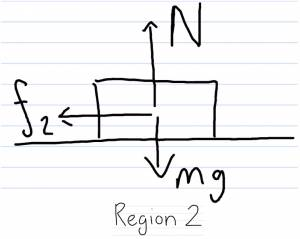
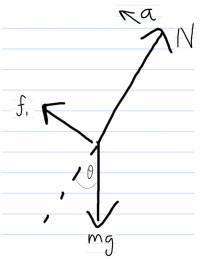
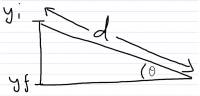

A little girl is riding her sled on a hill. If she starts a distance d up the hill, which makes an angle θ with the horizontal, how far will she travel along the flat snowy ground?

## Facts

Child on incline of θ.

The total mass of the sled and child = m.

There's a small bit of friction between the rails of the sled and the snow = (μ_k).

Slope length = L

Initial state: at rest, at height above horizontal

Final state: at rest on horizontal

## Lacking

How far will she travel along the flat?

## Approximations & Assumptions

Coefficient for kinetic friction for flat + incline is the same.

No wind resistance.

## Representations

System: Sled + Kid + Earth

Surroundings: Snow

$$
\Delta E_{system} = W_{surroundings}
$$

$$
\Delta K + \Delta U_{g} = W_{friction}
$$

## Solution

We could solve this using forces of kinematics; but, let's apply the energy principle because we can avoid vector quantities in the calculation.

First we must decide the system and surroundings.

System: Sled+Kid+Earth Surroundings: Snow

Starting with the principle that change in energy in the system is equal to the work done by the surroundings.

$$
\Delta E_{system} = W_{surroundings}
$$

The change in energy can be in the form of change of kinetic and change in gravitational potential energy.

$$
\Delta K + \Delta U_{g} = W_{friction}
$$

No change

$$
\Delta K = 0
$$

as its initial and final state of the sled is at rest.

$$
\Delta U_{g} = W_{friction} \rightarrow W_{friction}?
$$

Here, we pause because we have two different regions to consider.

The frictional force is different in the two regions so we must consider the work they do separately.

$$
\Delta U_{g} = W_{1} + W_{2}
$$

Breaking work down into force by change in distance.

$$
\Delta U_{g} = {\overset{\rightarrow}{f}}_{1} \cdot \Delta{\overset{\rightarrow}{r}}_{1} + {\overset{\rightarrow}{f}}_{2} \cdot \Delta{\overset{\rightarrow}{r}}_{2}
$$

${\overset{\rightarrow}{r}}_{2}$ is what we are trying to solve for as this is the position change along flat part.

What's $f_{1}$ and $f_{2}?$

Need to find $f_{1}$ & $f_{2}$

To find $F_{1}$ we can say that the sum of the forces in the x direction are equal to $ma_{1}$ But we don't need this because we know that $f_{1} = \mu_{k}N$.

$\sum F_{x} = f_{1} - mgsin\theta = ma_{1}$​

The sum of the forces in the y direction we do need because this allows us to express N.

$$
\sum F_{y} = N - mgcos\theta = 0
$$

$$
mgcos\theta = N
$$

If $f_{1} = \mu_{k}N$ then:

$$
f_{1} = \mu_{k}mgcos\theta
$$

To find $f_{2}$ we must do the same thing and add all the forces in the x and y directions. Again because not using kinematics we don't need accelerations and instead want an equation that expresses $f_{2}$.

$$
\sum F_{x} = f_{2} = ma_{2} \rightarrow f_{2} = \mu_{k}N = \mu_{k}mg
$$

$$
\sum F_{y} = N - mg = 0
$$

We substitute in for $f_{1}$, $f_{2}$ and d the distance down the slope into the previous equation for gravitational potential energy with minuses on the ${\overset{\rightarrow}{f}}'s$ as they are in opposition of the ${\overset{\rightarrow}{r}}'s$.

$$
\Delta U_{g} = {\overset{\rightarrow}{f}}_{1} \cdot \Delta{\overset{\rightarrow}{r}}_{1} + {\overset{\rightarrow}{f}}_{2} \cdot \Delta{\overset{\rightarrow}{r}}_{2}
$$

In the previous equation ${\overset{\rightarrow}{f}}_{1} \cdot \Delta{\overset{\rightarrow}{r}}_{1} \rightarrow W_{1} < 0$ and ${\overset{\rightarrow}{f}}_{2} \cdot \Delta{\overset{\rightarrow}{r}}_{2} \rightarrow W_{2} < 0$ because $\overset{\rightarrow}{f}$'s are opposite to $\Delta\overset{\rightarrow}{r}$'s

$$
\Delta U_{g} = - (\mu_{k}mgcos\theta)d - (\mu_{k}mg)x
$$

Substitute in the equation for gravitational potential energy for $\Delta U_{g}$

$$
+ mg(y_{f} - y_{i}) = - \mu_{k}mgdcos\theta - \mu_{k}mgx
$$

Rearrange to get the following expression.

$$
y_{f} - y_{i} = - \mu_{k}(dcos\theta + x)
$$

What is $y_{f} - y_{i}$ in terms of what we know? Eventually we want to express x in terms of variables we know.

From the diagram of the incline we get:

$$
y_{f} - y_{i} = - dsin\theta
$$

Substitue $- dsin\theta$ for $y_{f} - y_{i}$ and then rearrange to express x in terms of known variables.

$$
- dsin\theta = - \mu_{k}(dcos\theta + x)
$$

$$
dcos\theta + x = \frac{d}{\mu_{k}}sin\theta
$$

$$
x = \frac{d}{\mu_{k}}sin\theta - dcos\theta
$$

$$
x = d(\frac{sin\theta - \mu_{k}cos\theta}{\mu_{k}})
$$

A check of the units reveals that:

\[x\]=m

\[d\]=m

Which makes sense as all the other quantities are unit less.

$E = \gamma mc^{2}$​
