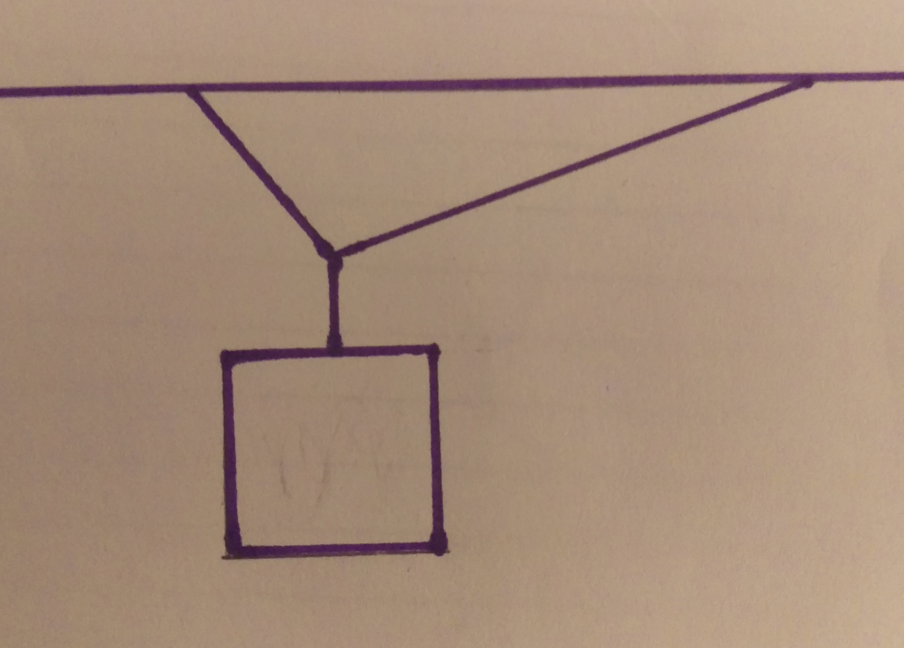
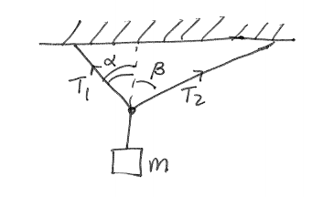

 If a sign were hung like the one above, what would be the tension forces acting on both of the ropes?

## Setup

To solve for the force of tension in both rope 1 and 2, both forces have to broken down into their x and y components, and then solve the resulting system of equations.

### Facts

- The system is stationary
- Gravity works in the negative y direction, with $g = 9.81m/s^{2}$
- There are two forces of tension, on for rope 1, and one for rope 2

### Lacking

- The force of tension of both of the ropes
- Mass of the object
- Angles of the ropes

### Approximations & Assumptions

- The lengths of the two ropes is irrelevant, only the angle matters to solve for the two forces
- The net force is zero, since the system is stationary

### Representations

## Solution

We assume the net force is zero, so

$$
F_{net} = \sum F = \sum F_{x} + \sum F_{y} = 0.
$$

To find the forces acting the the x direction, we have to decompose the tension of both ropes. For rope 1,

$$
T_{1,x} = T_{1}\sin\alpha
$$

For rope 2,

$$
T_{2,x} = T_{2}\sin\beta.
$$

One important note is since the force of tension of the two ropes point in opposite directions, their signs must be different. As convention, the force pointing to the left will be negative in these calculations. Now we know the net force in the x direction

$$
\sum F_{x} = T_{2}\sin\beta - T_{1}\sin\alpha = 0.
$$

Next, we will use the same technique to decompose the forces in the y direction. For rope one,

$$
T_{1,y} = T_{1}\cos\alpha
$$

For rope 2,

$$
T_{2,y} = T_{2}\cos\beta.
$$

When finding the net force in the y direction, we cannot forget our assumption that gravity also works in the y direction but in the opposite direction as our tension forces. The net force in the y direction is,

$$
\sum F_{y} = T_{1}\cos\alpha + T_{2}\cos\beta - Mg = 0.
$$

Now we have two unknowns (the tension of the two ropes) and two equations, so we can solve this as a system of equations. The force of tension in the x direction can be rearranged to solve for one of the unknowns, in this case $T_{1}$

$$
T_{2}\sin\beta - T_{1}\sin\alpha = 0
$$

$$
T_{1} = T_{2}\frac{\sin\beta}{\sin\alpha}
$$

Now we can plug this solution for $T_{1}$ into the equation we have for the tension force in the y direction

$$
T_{1}\cos\alpha + T_{2}\cos\beta - Mg = 0
$$

$$
T_{2}\frac{\sin\beta}{\sin\alpha}cos\alpha + T_{2}\cos\beta - Mg = 0
$$

And solve for $T_{2}$ (should I add more steps?)

$$
T_{2} = \frac{Mg}{(\frac{\sin\beta}{\tan\alpha} + \cos\beta)}
$$

Now we have solutions for both tension forces, $T_{1}$ and $T_{2}$
