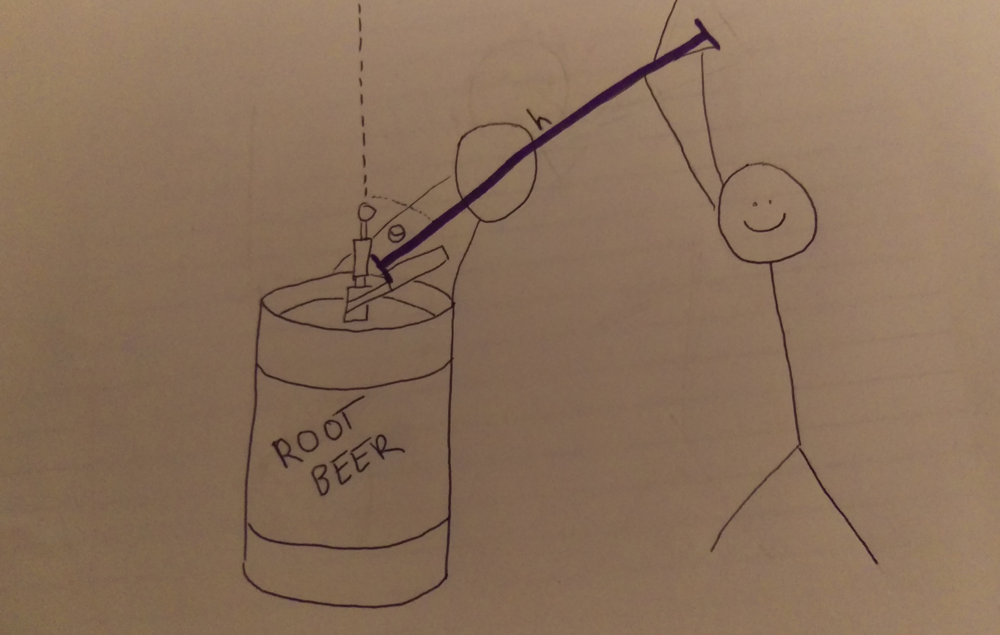
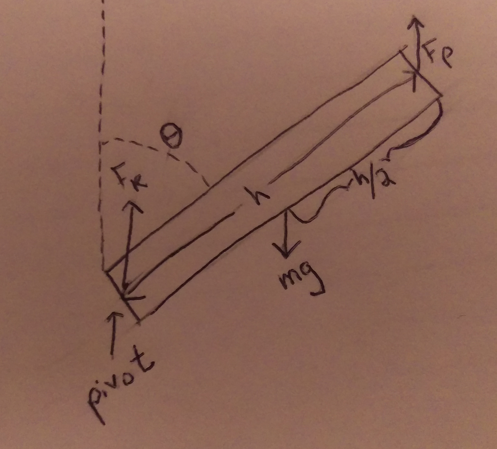

 Find the force a person would have to apply support their friend doing a keg stand

## Setup

### Facts

- Gravity will apply a negative acceleration of $9.81m/s^{2}$

### Lacking

- Force of the person holding up the kegstandee
- Torque of the person holding up their friend doing a keg stand
- Force and torque due to gravity
- Force and torque due to the keg itself

### Approximations & Assumptions

- The pivot will be at the keg

### Representations

## Solution

Since the system is stationary, we know that both the net force and the net torque are equal to zero

$$
\sum F = F_{net} = 0
$$

$$
\sum\tau = \tau_{net} = 0
$$

There are three forces acting on the person doing the keg stand. There's the force of the keg pushing them up ($F_{k}$), the force of the person pushing them up ($F_{p}$), and the force of gravity pulling them down ($F_{g}$). These all sum up to zero.

$$
F_{net} = F_{k} + F_{p} - F_{g} = 0
$$

All of these forces apply a torque on the person performing a keg stand. The torque equation is

$$
\tau = rF\sin\theta.
$$

Where r (show by h in this problem) is the distance between where the force is applied and the pivot of the system (the point it is rotating around), F is the amount of force, and $\theta$ is the angle at which this force is applied. Now we can find the net torque of the system. Based on the diagram, we can determine that the pivot point of the system is at the keg, and the person turns around this. We can use this information to determine the radii of the three torques in our system. Torque due to the keg ($\tau_{k}$), torque due to the support of the person ($\tau_{p}$), and torque due to gravity ($\tau_{g}$). The torque due to gravity will be negative since it acts in the opposite direction of the other two.

$$
\tau_{net} = \tau_{k} + \tau_{p} - \tau_{g} = 0
$$

The radius of the torque due to the keg is zero, since we established that the keg is at the pivot point. The radius of the torque due to the support of the person is the full length of the person being supported, since they are supported at their feet. The radius of the torque due to gravity is at half of the length of the supported person, since this is approximately their center of mass.

$$
\tau_{net} = 0(F_{k}\sin_{\theta}) + hF_{p}\sin\theta - \frac{h}{2}F_{g}\sin\theta = 0
$$

And from here we can solve for the desired force that the supporting person places on the person doing the keg stand

$$
hF_{p}\sin\theta = \frac{h}{2}F_{g}\sin\theta
$$

$$
F_{p} = \frac{F_{g}}{2}
$$

$$
F_{p} = \frac{mg}{2}
$$

The friend has to support half of the weight of the person doing the keg stand.
