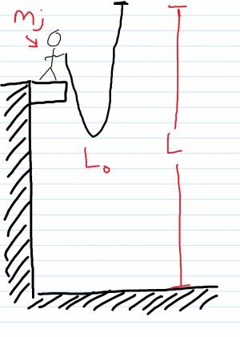

After earning an 'A' in PHY 183 you land a job with ACME Bungee Jump company. They need to know what spring stiffness k_S to make the cords so that a jumper of mass 200kg will only fall 30m. The standard length of an un-stretched cord is just 10m.

## Facts

Jumper of mass 200kg

Jumper will fall 30m

Standard length of un-stretched cord is 10m

Initial State: Jumper motionless at top

Final State: Jumper motionless 30m below

## Lacking

k_s

## Approximations & Assumptions

Jumper is motionless before they start

No energy lost to the surroundings

## Representations

System: Jumper + Cord + Earth

Surroundings: Nothing

$$
\Delta E_{system} = W_{surroundings}
$$

$$
\Delta U_{grav} = mg(y_{f} - y_{i})
$$

$$
\Delta U_{spring} = \frac{1}{2}ks({s_{f}}^{2} - {s_{i}}^{2})
$$

## Solution

The first step is defining the system and surroundings which we have done in representations section, with the jumper, cord and Earth parts of the system and the surroundings being nothing.

Energy of the system is equal to the work done by the surroundings.

$$
\Delta E_{system} = W_{surroundings}
$$

In the initial state of the problem the sum of the kinetic and potential energies is equal to zero since there is no work done by the surroundings.

$$
\Delta K_{jumper} + \Delta U_{grav} + \Delta U_{spring} = W_{surroundings} = 0
$$

$$
\Delta K_{jumper}
$$

(is 0 because jumper is motionless before + after jump)

$W_{surroundings}$ (no work)

Let gravitational potential energy equal to potential energy of a spring so that you can solve for k\_{s}

$$
\Delta U_{grav} = - \Delta U_{spring}
$$

Sub in formulas for gravitational potential energy and potential energy into equation.

$$
mg(y_{f} - y_{i}) = \frac{1}{2}ks({s_{f}}^{2} - {s_{i}}^{2})
$$

${s_{i}}^{2} = 0$ There is no stretch initially.

You can cancel out s\_{i}.

$$
m_{j}(y_{f} - y_{i}) = - \frac{1}{2}ks({s_{f}}^{2})
$$

Rearrange the equation to solve for k\_{s}:

$$
k_{s} = \frac{- 2m_{j}g(y_{f} - y_{i})}{{s_{f}}^{2}} > 0
$$

We expect k\_{s} to be greater than 0 which makes sense because $(y_{f} - y_{i}) < 0$ due to the person dropping 30m from its initial height.

$s_{f} = L - L_{0}$​

You were told in the question that when not stretched the cord is 10m and the stretched length is 30m.

$$
k_{s} = \frac{- 2(200kg)(9.81m/s^{2})( - 30m)}{{(30m - 10m)}^{2}}
$$

Substitute in for various variables to solve for k\_{s}

$$
k_{s} = 294N/m
$$
