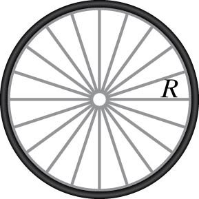

A bicycle wheel has almost all its mass M located in the outer rim at radius R. What is the moment of inertia of the bicycle wheel about its center of mass?

(Hint: It's helpful to think of dividing the wheel into the atoms it is made of and think about how much each atom contributes to the moment of inertia.)

## Facts

Bicycle wheel has a mass of M

Outer rim of bicycle wheel is at a radius R

## Assumptions and Approximations

Assume the mass of the spokes is negligible

Thickness of the rim sufficiently thin so all of the mass is located at radius R

## Lacking

A representation for the moment of inertia of the bicycle wheel about its center of mass

## Representations

$I = m_{1}r_{\bot 1}^{2}$ + $m_{2}r_{\bot 2}^{2}$

## Solution

Let m represent the mass of one atom in the rim. The moment of inertia is therefore

$I = m_{1}r_{\bot 1}^{2}$ + $m_{2}r_{\bot 2}^{2}$ + $m_{3}r_{\bot 3}^{3}$ + $m_{4}r_{\bot 4}^{4} + \cdot \cdot \cdot$

Substitute R for $r_{\bot 1}$ and so forth as this the outer rim radius.

$I = m_{1}R^{2} + m_{2}R^{2} + m_{3}R^{2} + m_{4}R^{2} + \cdot \cdot \cdot$​

Gather the R's

$I = \lbrack m_{1} + m_{1} + m_{1} + m_{1} + \cdot \cdot \cdot \rbrack R^{2}$​

We've assumed that the mass of the spokes is negligible compared to the mass of the rim, so that the total mass os just the mass of the atoms in the rim. Therefore the moment of inertia of a Bicycle Wheel is:

$I = MR^{2}$​
