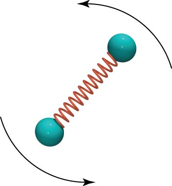

What is the moment of inertia of a diatomic nitrogen molecule $N_{2}$ around its center of mass. The mass of a nitrogen atom is $2.3$ x $10^{- 26}$ kg and the average distance between nuclei is $1.5$ x $10^{- 10}$ m. Use the definition of moment of inertia carefully.

## Facts

Mass of nitrogen atom is 2.3 x $10^{- 26}$kg

Average distance between nuclei is 1.5 x $10^{- 10}$m

## Assumptions and Approximations

The distance between the atoms in the molecule does not change.

The model of the system you are using includes a spring between the atoms but these are not actual springs so the spring has no mass.

## Lacking

The moment of inertia of a diatomic nitrogen molecule $N_{2}$ around its center of mass?

## Representations

$I = m_{1}r_{\bot 1}^{2}$​

## Solution

For two masses, $I = m_{1}r_{\bot 1}^{2}$ + $m_{2}r_{\bot 2}^{2}$.

The distance between the masses is d, so the distance of each object from the center of mass is $r_{\bot 1} = r_{\bot 2} = d/2$.

Therefore:

$I = M(d/2)^{2} + M(d/2)^{2} = 2M(d/2)^{2}$​

Where you substitute in M for $m_{1}$ and $m_{2}$ as it is the same total mass we are talking about.

Substitute in given values for variables.

$I = 2 \cdot (2.3$ x $10^{- 26}kg)(0.75$ x $10^{- 10}m)^{2}$

Compute moment of inertia of diatomic nitrogen molecule

$I = 2.6$ x $10^{- 46}kg \cdot m^{2}$
