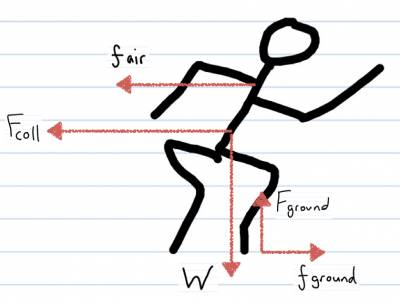

Two students are running to make it to class. They turn a corner and collide; coming to a complete stop. What force did they exert on each other.

## Facts

Average mass of a person 68kg.

Students come to complete stop.

Choose student 1 as our system.

## Lacking

Collision time $\Delta t$

Force of collision on student 1 in x-direction.

## Approximations & Assumptions

Approximate speed of person 5m/s^-1 (half speed of olympic sprinter)

On average student 1's body compresses a couple of cm on average - assume compression of 2.5cm.

## Representations

$\Delta{\overset{\rightarrow}{p}}_{sys} = {\overset{\rightarrow}{F}}_{ext}\Delta t$​

${\overset{\rightarrow}{p}}_{sys,f} = {\overset{\rightarrow}{p}}_{sys,i} + {\overset{\rightarrow}{F}}_{ext}\Delta t$​

${\overset{\rightarrow}{v}}_{avg} = \frac{{\overset{\rightarrow}{v}}_{f} + {\overset{\rightarrow}{v}}_{i}}{2} = \frac{\Delta\overset{\rightarrow}{r}}{\Delta t}$​

## Solution

We use the momentum principle to relate the momentum of the students to the force applied. We have chosen student 1 as our system.

$p_{fx} = p_{ix} + F_{x,coll}\Delta t$​

We are told that the students come to a complete stop and so $p_{fx}$ = 0.

$0 = MV_{ix} + F_{x,coll}\Delta t$​

Rearranging the equation we relate $F_{x,coll}$ to the remaining variables. We are trying to find force.

$F_{x,coll} = \frac{- MV_{ix}}{\Delta t}$​

The negative sign means that the force is in $- \widehat{x}$ direction.

Now that we have the above relationship we must find the missing variables in order to solve for $F_{x,coll}$. First we need to find collision time $\Delta t$. We can relate the average velocity to displacement over time.

${\overset{\rightarrow}{v}}_{avg} = \frac{{\overset{\rightarrow}{v}}_{f} + {\overset{\rightarrow}{v}}_{i}}{2} = \frac{\Delta\overset{\rightarrow}{r}}{\Delta t}$​

In 1D this looks like: ${\overset{\rightarrow}{v}}_{avg} = \frac{\Delta x}{\Delta t} = \frac{{\overset{\rightarrow}{v}}_{f} + {\overset{\rightarrow}{v}}_{i}}{2}$

Relate these 3 equations together to solve for $\Delta t$

$\Delta t = \frac{\Delta x}{V_{avg}} = \frac{\Delta x}{\frac{{\overset{\rightarrow}{v}}_{f} + {\overset{\rightarrow}{v}}_{i}}{2}}$​

Fill in the values for the variables from the assumptions and approximations you made previous.

$\frac{0.025}{\frac{5m/s + 0m/s}{2}} = 0.01s$​

Having solved for $\Delta t$ fill this value and the known value for mass and the approximated value for velocity into the equation that we arranged earlier to find $F_{x,coll}$

$F_{x,coll} = \frac{- MV_{ix}}{\Delta t} = - \frac{(68kg)(5m/s)}{0.01s}$​

$= - 34,000\, N$​
