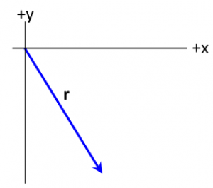
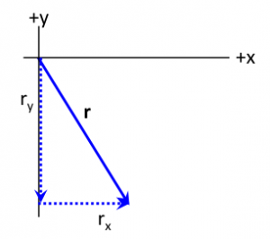

Determining the [components of a vector](/pcubed/notes/week-01-modeling-motion-no-net-force/scalars_and_vectors/) in a given or established coordinate system is crucial for being able to explain or predict the motion of systems. In addition to other uses, in mechanics, decomposing vectors into their components is quite often used to determine [the net force](/pcubed/notes/week-02-modeling-motion-net-force/momentum_principle/) along particular directions. Such information is useful when making predictions or constructing explanations of the motion.

In the figure below, a position vector has been drawn. It has a magnitude of $5\ m$ and makes an angle of 35$^{\circ}$ with the negative y-axis. Determine the components of this vector in the coordinate system that is drawn.

## Solution

You might want to immediately apply the formulae: $r_{x} = |\overset{\rightarrow}{r}|\cos\theta$ and $r_{y} = |\overset{\rightarrow}{r}|\sin\theta$. But you should first check that they apply, and if not, you need to re-derive the formulae. If we draw the triangle where the base and height are the $x$ and $y$ components respectively, we can determine if the formula above will work.

The angle that you know ($\theta = 35^{\circ}$) is the one that the vector makes with the negative y-axis. So the opposite side is the $x$-component. Hence the above formula do not apply and,

$$
r_{x} = |\overset{\rightarrow}{r}|\sin(\theta) = (5\ m)\sin(35^{\circ}) = 2.87\ m
$$

The $y$-component is the adjacent side and is negative. Hence,

$$
r_{y} = - |\overset{\rightarrow}{r}|\cos(\theta) = - (5\ m)\cos(35^{\circ}) = - 4.10\ m
$$

where the minus sign was introduced because the measure of the angle was less than 90$^{\circ}$.
