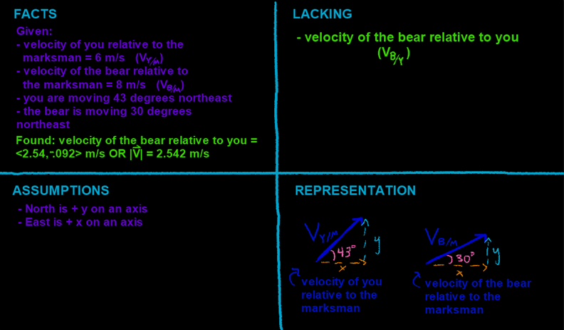

## Video

Part 1: You're being chased by a bear in a forest, where a marksman is waiting to shoot the bear with a tranquilizer dart. The marksman measures your velocity as 6 m/s at 43 degrees northeast. The bear's velocity is measured as 8 m/s at 30 degrees northeast.

a\) What are these two velocities in vector form?



------------------------------------------------------------------------

Part 2:

b\) What is the velocity of the bear relative to you?



## Four Quadrants

