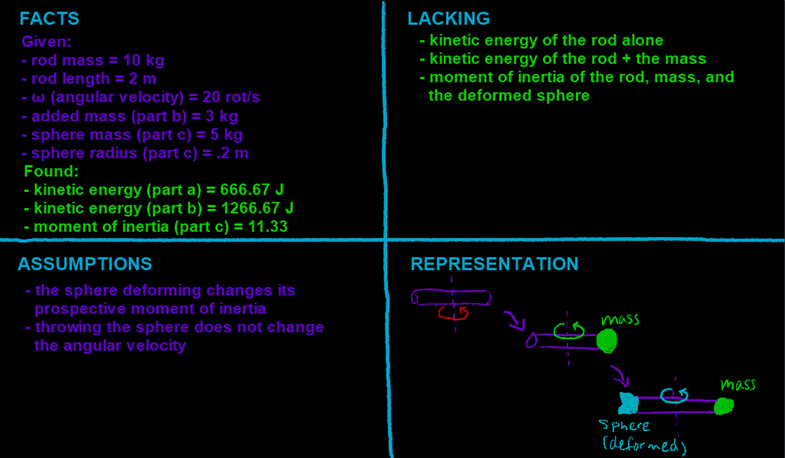

## Video

Part 1:

You have a rod spinning as depicted in the diagram (in the video). Its length is 2 m and its mass is 10 kg, rotating at a rate of 20 rad/s.

a\) What is the rotational kinetic energy of the rod?



------------------------------------------------------------------------

Part 2:

b\) A 3 kg mass is attached to the end of the rod. What is the rotational kinetic energy of this system?



------------------------------------------------------------------------

Part 3:

c\) Someone throws a sphere (radius = 1 cm, mass = 5 kg) at the other end of the rod, where it sticks and deforms. What is the new moment of inertia?



## Four Quadrants

