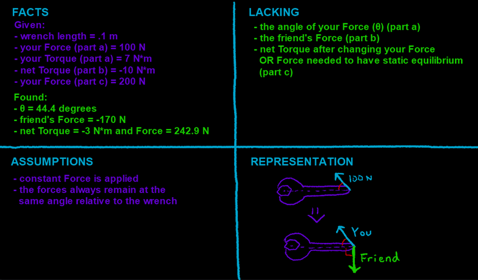

## Video

Part 1:

Using a .1 m length wrench, you screw a bolt with 100 N of force at an unknown angle.

a\) If your Torque = 7 N\*m, what is the angle of your force?



------------------------------------------------------------------------

Part 2:

b\) Your “friend” decides to “help you” screw the bolt in. He actually changes the Torque from 7 N\*m to -10 N\*m. What is the force he is applying if his force is perpendicular to the wrench?



------------------------------------------------------------------------

Part 3:

c\) You change your force to 200 N, keeping your hand at an angle, to try and change the torque from negative to positive. Does it work? IF not, what force is needed to achieve at least static equilibrium?



## Four Quadrants

