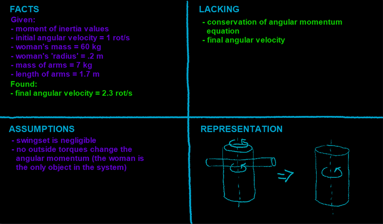

## Video

Part 1:

A young woman is standing on a swing, spinning at a rate of 1 rot/s. Her arms are initially straight out from her body, then she tucks them into herself, changing her rotating speed. She is 60 kg, with her arms being 7 kg altogether.

a\) Using the diagrams (in the video), (assuming the swing itself is negligible), use only variables to equate the initial and final states of angular momentum.



------------------------------------------------------------------------

Part 2:

b\) Using the equation created in part A, what is the final angular velocity of the woman? Her torso's radius is .2 m and her arms are 1.7 m long.



## Four Quadrants

