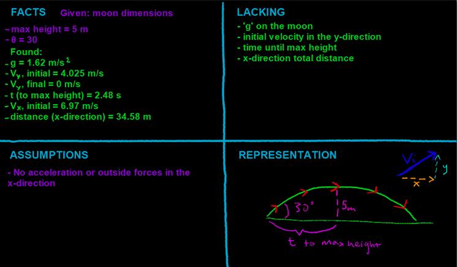

## Video

Part 1:

The diagram to the right (in the video) represents the motion of a rock launched from the surface of the moon. The rock is 2 kg, reaches a maximum height of 5 m, and is launched at an angle of 30 degrees.

a\) Calculate 'g' on the moon.



------------------------------------------------------------------------

Part 2:

b\) What is the initial y-direction velocity of the rock?



------------------------------------------------------------------------

Part 3:

c\) How long does it take for the rock to reach its maximum height?



------------------------------------------------------------------------

Part 4:

d\) How far in the x-direction did the rock travel?



## Four Quadrants

