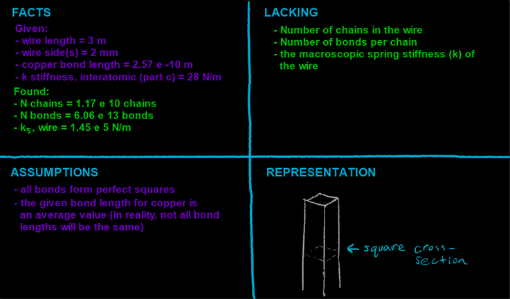

## Video

Part 1:

You have a wire with a square-shaped cross-section. It's 3 m in length and made of copper (bond length = 2.57 e -10 m). The sides of the wire are 2mm wide.

a\) Calculate the number of chains in the wire.



------------------------------------------------------------------------

Part 2:

b\) Calculate the number of bonds per chain in the wire.



------------------------------------------------------------------------

Part 3:

c\) Calculate the macroscopic spring stiffness constant of the wire if the interatomic spring stiffness is 28 N/m.



## Four Quadrants

