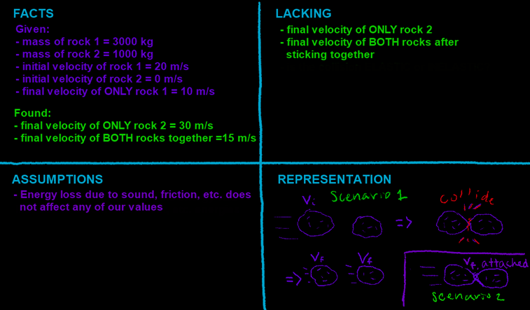

## Video

Part 1:

Two rocks are floating off in space. You've observed that the first rock has a mass of 3000 kg and an initial velocity of 20 m/s. The second rock has a mass of 1000 kg and no initial velocity. The two rocks collide; rock one hits rock two, leaving rock one with a velocity of 10 m/s.

a\) What is rock two's final velocity?



------------------------------------------------------------------------

Part 2:

In a different collision, the two rocks have the same initial parameters, but when they collide, they attach and move off together in the same direction.

b\) What is the final velocity of the attached rocks?



## Four Quadrants

