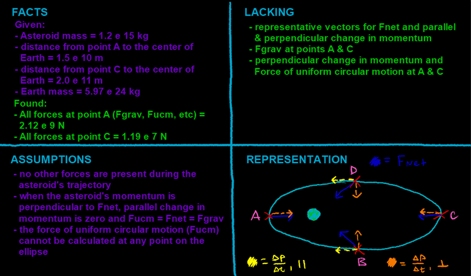

## Video

Part 1:

An asteroid, m = 1.2 e 15 kg, is in an elliptical orbit around Earth. You observe its orbit at points A, B, C, and D.

a\) Draw vectors that represent the asteroid's Net Force and its Parallel & Perpendicular change in momentum at each point.



------------------------------------------------------------------------

Part 2:

At point A, your asteroid is 1.5 e 10 m away from the center of Earth. At point C, it's 2.0 e 11 m away. Calculate the Force of Gravity at both of these points, then the perpendicular change in momentum and the force of uniform circular motion at A & C.



## Four Quadrants

