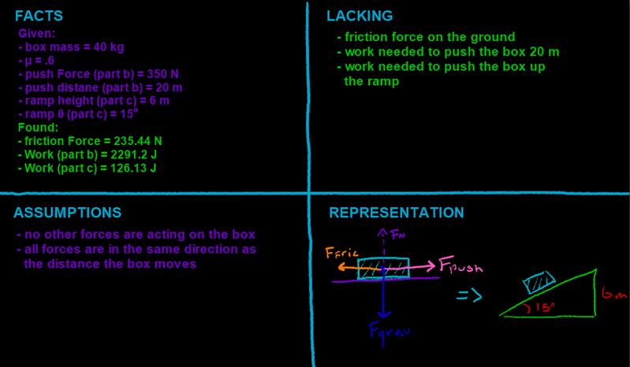

## Video

Part 1:

You want to push a 40 kg box along a floor that has a coefficient of friction of .6.

a\) Calculate the expected friction force that will act against your motion.



------------------------------------------------------------------------

Part 2:

You apply a force of 350 N for a distance of 20 m. How much work was done?



------------------------------------------------------------------------

Part 3:

c\) You soon meet an incline of 15 degrees, 6 m in height. How does the work change if you apply the same force up the incline?



## Four Quadrants

