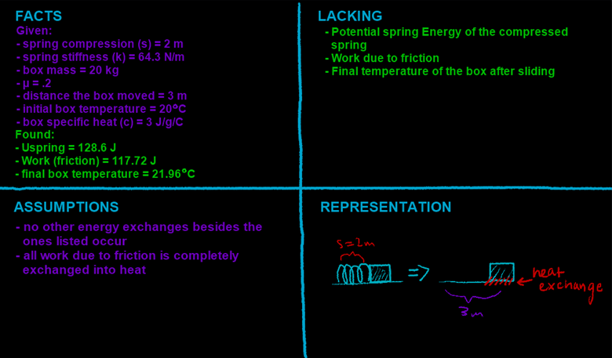

## Video

Part 1:

You have a large spring that has been compressed 2 meters. It has a spring stiffness constant of 64.3 N/m.

a\) What is the spring potential energy of the spring?



------------------------------------------------------------------------

Part 2:

b\) A 20 kg box rests at the end of the compressed spring. After releasing the spring, your Kinetic Energy does not end up the value you expect, since the box had slid across the ground (with a coefficient of friction of .2).

How much work is done by friction if your box moved 3 meters?



------------------------------------------------------------------------

Part 3:

c\) Your box began 20 degrees Celsius, with a specific heat of 3 J/g\*C. What is its final temperature after it stops sliding?



## Four Quadrants

