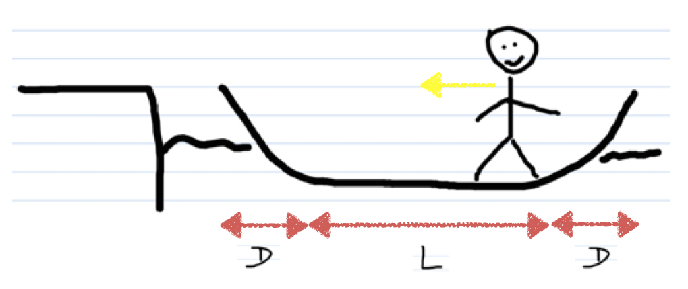
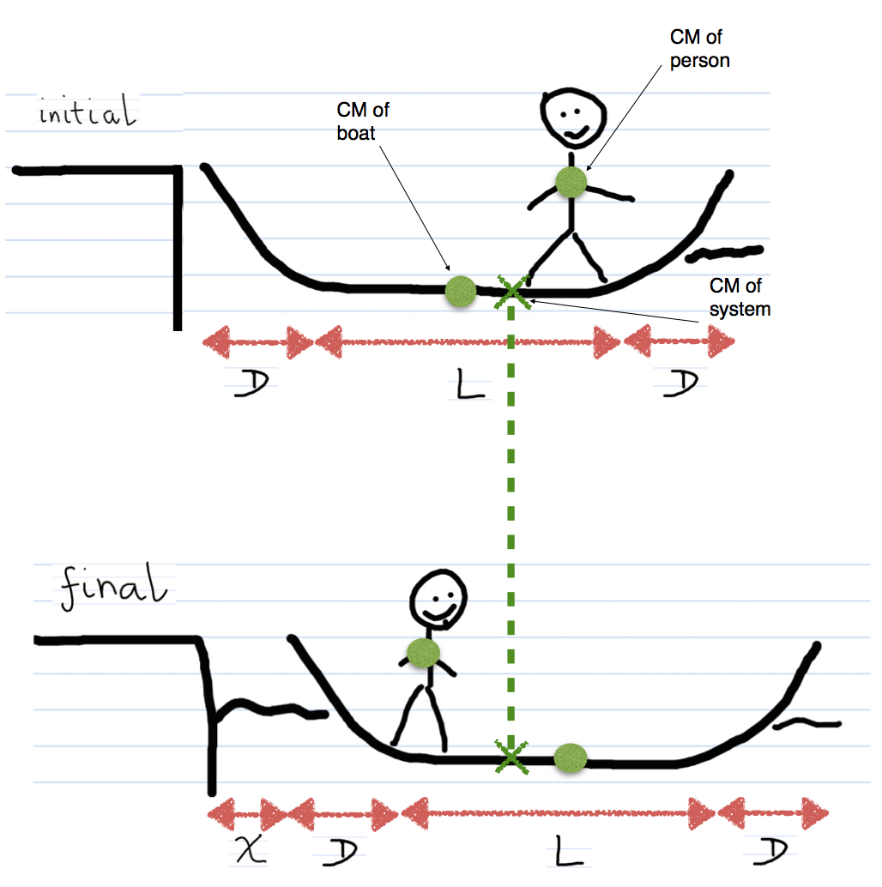

A person is standing in a boat that is a length 2D + L (see diagram). If they walk a distance L, how far is the boat from the dock?

Does the boat move L?

## Facts

Boat Length: 2D + L

Mass person: m

Mass of boat: M

Initial Momentum: Everything at rest $\overset{\rightarrow}{p_{i}} = 0$

Final Momentum: Everything at rest $\overset{\rightarrow}{p_{f}} = 0$

System: Boat + Person

Surroundings: Nothing

## Lacking

How far is boat from dock after moving?

## Approximations & Assumptions

Neglect friction between the boat and the water.

## Representations

$\Delta{\overset{\rightarrow}{p}}_{sys} = {\overset{\rightarrow}{F}}_{ext}\Delta t$​

${\overset{\rightarrow}{p}}_{sys,f} = {\overset{\rightarrow}{p}}_{sys,i}$​

${\overset{\rightarrow}{r}}_{cm} = \frac{1}{M_{tot}}\left( \sum_{i}^{}m_{i}{\overset{\rightarrow}{r}}_{i} \right)$ in 1D

## Solution

The expression for the momentum of the system (Boat + Person) is:

$\Delta{\overset{\rightarrow}{p}}_{sys} = {\overset{\rightarrow}{F}}_{ext}\Delta t$​

The change in momentum of the system is 0 as there are no external forces acting on the system.

$\Delta{\overset{\rightarrow}{p}}_{sys} = 0$​

Due to momentum being conserved in the system the initial momentum is equal to the final momentum.

$\overset{\rightarrow}{p_{i}} = \overset{\rightarrow}{p_{f}}$​

This means momentum is conserved and because $\overset{\rightarrow}{p_{i}} = \overset{\rightarrow}{p_{f}} = 0$ the center of the mass will not change its location. That is, the boat moves such that the center of mass is at the same location relative to the dock.

$\Delta{\overset{\rightarrow}{p}}_{sys} = 0 = M_{tot}\Delta{\overset{\rightarrow}{v}}_{cm} = 0$​

Since the mass of the system does not change the change in velocity of the center of mass is equal to zero.

$\Delta{\overset{\rightarrow}{v}}_{cm} = 0$​

Therefore the initial velocity of the center of mass of system is equal to the final velocity of the center of mass of the system.

${\overset{\rightarrow}{v}}_{cm,i} = {\overset{\rightarrow}{v}}_{cm,f}$​

Referring to the diagram above we can see that after the motion of the person the ${\overset{\rightarrow}{r}}_{cm}$ is the same and hence fixed $\rightarrow$ so both are zero.

The center of mass of a system is the weighted average of the particles in that system. The center of mass of the system in question is the vector sum of each part of the systems mass by their location relative to the origin.

Initially,

${\overset{\rightarrow}{r}}_{cm} = \frac{1}{M_{tot}}\left( \sum_{i}^{}m_{i}{\overset{\rightarrow}{r}}_{i} \right)$ in 1D,

Therefore $x_{cm,i}$ initial is the mass of the boat by the location relative to the origin plus the mass of the person by their location relative to the origin divided by the total mass of the system.

$x_{cm,i} = \frac{M(D + \frac{L}{2}) + m(D + L)}{M + m}$​

In the final state, we don't know x, but we know that $x_{cm,f} = x_{cm,i}$ So we'll just use the unknown x and insert the distance into the distances for boat and person relative to the origin.

$x_{cm,f} = \frac{M(x + D + \frac{L}{2}) + m(x + D)}{M + m}$​

As indicated the center of the mass of the system as not changed position therefore:

$x_{cm,f} = x_{cm,i}$​

So we can relate the equations for initial and final to each other:

$\frac{M(x + D + \frac{L}{2}) + m(x + D)}{M + m} = \frac{M(D + \frac{L}{2}) + m(D + L)}{M + m}$​

Both of these equations have the same denominator and so we can cancel it out:

$M(x + D + \frac{L}{2}) + m(x + D) = M(D + \frac{L}{2}) + m(D + L)$​

Multiply out to solve for x:

$Mx + M(D + \frac{L}{2}) + mx + mD = M(D + \frac{L}{2}) + mD + mL$​

Cancel like terms we get:

$Mx + mx = mL$​

So,

$(M + m)x = mL$​

Therefore:

$x = (\frac{m}{M + m})L$​

This is how far the canoe is from the dock.

Does this make sense?

If you want to check whether something makes sense a good start is to check the units:

Units $(x) = m$ $(\frac{m}{M + m})$ = unitless

Therefore m is the remaining unit.

Another check is that we know that if M is really big then $x \equiv 0$, think of a similar scenario to one just discussed occurring on a oil thanker.

$x = (\frac{m}{M + m})L \equiv \frac{m}{M}L \equiv 0$ when $M > > m$

Another check would be to check what happens when M = 0 then x $\equiv L$, i.e. if there was no boat.

$x = (\frac{m}{M + m})L \equiv \frac{m}{M}L \equiv L$ when $m > > M$

So the motion of the center of mass of a system is dictated by the net external force.
