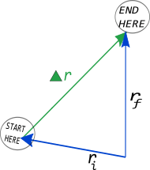

*Our job in mechanics is to predict or explain motion. So, all the models and tools that we develop are aimed at achieving this goal.*

The simplest model of motion is for an object that moves in a straight line at constant speed. You can use this simple model to build your understanding about the basic ideas of motion, and the different ways in which you will represent that motion. **At the end of these notes, you will find the position update formula, which is a useful tool for predicting motion (particularly, when it comes to constant velocity motion).**

### Lecture Video



### Motion (Changes of Position)

**Displacement** is a vector quantity that describes a change in position.

 The displacement vector ($\Delta\overset{\rightarrow}{r}$) describes the change of an object's position in space (i.e., a change in location). So, you can think of the displacement vector as *displacement = change in position = final location - initial location*. This change in position is represented in the diagram to the right. Mathematically, we represent the displacement like this:

$$
\Delta\overset{\rightarrow}{r} = {\overset{\rightarrow}{r}}_{final} - {\overset{\rightarrow}{r}}_{initial} = {\overset{\rightarrow}{r}}_{f} - {\overset{\rightarrow}{r}}_{i}
$$

where the subscripts “f” and “i” describe the *final* and *initial* locations respectively. You will often find it useful to have subscripts like those used above to distinguish between similar quantities (e.g., positions) that occur at different times (e.g., before some motion occurs and after that motion occurs).

In one dimension, you might consider motion along a specific coordinate axis or, if you like, the number line. In that case, you can still talk about displacement “in the x-direction.” Mathematically, we represent that kind of displacement like this:

$$
\Delta x = x_{f} - x_{i}
$$

*Note that this displacement maybe positive, negative, or zero, as this is the component of the displacement vector in the x-direction.*

The units of displacement are units of length, which are typically the SI units of **meters (m).**

## Velocity and Speed

**Velocity** is a vector quantity that describes the rate of change of the displacement.

### Average Velocity

**Average Velocity** (${\overset{\rightarrow}{v}}_{avg}$) describes how an object changes its displacement in a given time. To compute an object's average velocity, you will need the position of the object at two different times. You can think of it as *average velocity = displacement divided by time elapsed*. Mathematically, we can represent the average velocity like this:

$$
{\overset{\rightarrow}{v}}_{avg} = \frac{\Delta\overset{\rightarrow}{r}}{\Delta t} = \frac{{\overset{\rightarrow}{r}}_{f} - {\overset{\rightarrow}{r}}_{i}}{t_{f} - t_{i}}
$$

In one dimension, you can still think about average velocity in a coordinate direction. In this case, you might consider the number line where displacement to the right is positive and displacement to the left is negative. Mathematically, in the x-direction, you would represent the average velocity in the x-direction like this:

$$
v_{x,avg} = \frac{\Delta x}{\Delta t} = \frac{x_{f} - x_{i}}{t_{f} - t_{i}}
$$

where $t_{f} - t_{i}$ is always positive, but $x_{f} - x_{i}$ can be positive, negative, or zero because it represents the displacement in the x-direction, which is a vector component.

### Approximate Average Velocity

The average velocity is defined as the displacement over a given time, but what about the *arithmetic* average velocity? How do the arithmetic average velocity and average velocity compare?

The arithmetic average velocity is an approximation to the average velocity.

$$
v_{x,avg} = \frac{\Delta x}{\Delta t} \approx \frac{v_{ix} + v_{fx}}{2}
$$

*This equation only hold exactly if the velocity changes linearly with time ([constant force motion](/notes/week-02-modeling-motion-net-force/constantf/)).* It might be a very poor approximation if velocity changes in other ways.

### Instantaneous Velocity

**Instantaneous velocity** ($\overset{\rightarrow}{v}$) describes how quickly an object is moving at a specific point in time. If you consider the displacement over shorter and shorter $\Delta t$'s, your computation will give a reasonable approximation for the instantaneous velocity. In the limit that $\Delta t$ goes to zero, your computation would be exact. Mathematically, we represent the instantaneous velocity like this:

$$
\overset{\rightarrow}{v} = \lim_{\Delta t \rightarrow 0}\frac{\Delta\overset{\rightarrow}{r}}{\Delta t} = \frac{d\overset{\rightarrow}{r}}{dt}
$$

In one dimension, you can still think about instantaneous velocity in a coordinate direction. Again, consider a number line where displacement to the right is positive and to the left is negative. Mathematically, in x-direction, we represent the instantaneous velocity like this:

$$
v_{x} = \lim_{\Delta t \rightarrow 0}\frac{\Delta x}{\Delta t} = \frac{dx}{dt}
$$

### Speed

**Speed** is a scalar quantity that describes that distance (not the displacement) traveled over an elapsed time.

**Average speed** ($s$) describes how quickly an object covers a given distance in a given amount of time. So, you can think of it as *average speed = total distance traveled divided by total time elapsed*. Mathematically, we represent the average speed like this:

$$
s = \frac{d}{t}
$$

where $d$ is the total distance traveled and $t$ is the total time elapsed. The scalar quantities: $s$, $d$, and $t$ are all positive.

Instantaneous speed describes the magnitude of the instantaneous velocity. It is how fast an object is moving at an instant. Mathematically, we represent the instantaneous velocity like this:

$$
|\overset{\rightarrow}{v}| = \sqrt{v_{x}^{2} + v_{y}^{2} + v_{z}^{2}}
$$

*Notice that the instantaneous velocity is equivalent to the magnitude of the velocity vector and, therefore, is a positive scalar quantity.*

### Predicting the motion of objects

We can rewrite the definition of average velocity above to give us information about the displacement of an object,

$$
\Delta\overset{\rightarrow}{r} = {\overset{\rightarrow}{r}}_{f} - {\overset{\rightarrow}{r}}_{i} = {\overset{\rightarrow}{v}}_{avg}\Delta t
$$

This equation tells us that given a certain average velocity (${\overset{\rightarrow}{v}}_{avg}$) over a known time interval ($\Delta t$), an object will experience a particular displacement ($\Delta\overset{\rightarrow}{r}$). By moving the initial position over to the left side, we get the *“position update”* formula,

$$
{\overset{\rightarrow}{r}}_{f} = {\overset{\rightarrow}{r}}_{i} + {\overset{\rightarrow}{v}}_{avg}\Delta t
$$

which allows us to predict the location of an object given its initial position and average motion. This formula is a very powerful because it allows us to predict where an object will be given only information about it now.

### What's so special about constant velocity motion?

Constant velocity motion is motion that occurs when an object travels in a straight line at constant speed, or, more realistically, can be considered to *approximately* travel in a straight line at constant speed. That is, for this object its velocity remains unchanged because there are [no external influences on the motion](/notes/week-02-modeling-motion-net-force/momentum_principle/).

For constant velocity motion, the velocity is a constant vector and, hence, the average and instantaneous velocities are equivalent. That is, *for constant velocity motion only*:

$$
{\overset{\rightarrow}{v}}_{avg} = \overset{\rightarrow}{v}
$$

The object changes its position at a constant rate. In the position update formula, we can replace the average velocity with simply the instantaneous velocity,

$$
{\overset{\rightarrow}{r}}_{f} = {\overset{\rightarrow}{r}}_{i} + \overset{\rightarrow}{v}\Delta t
$$

## Examples

- 

<!-- -->

- 
