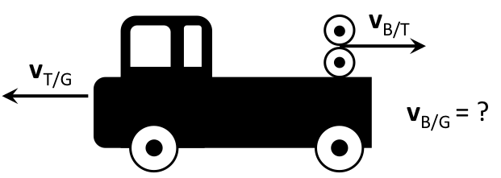

All motion requires a frame of reference, an origin from which to make measurements of displacement, and thus velocity, and so on.

In many cases, you can take the origin as fixed and make all measurements from that origin. But what happens if you are in a plane, in car, or on a train? Below is a video made to demonstrate what happens when you compare measurements in fixed and moving reference frames. **At the end of these notes, you will find a formula that can be used to relate velocities measured in different reference frames.**



*This video's audio is not in English. Please note that the visual understanding is the primary focus.*

We need a way to describe measurements in frames that are moving relative to each other. Consider the example of the truck and the pitching machine in the video above. The truck moves to the left with a speed of 100km/hr while the baseball is fired from the truck to the right with a speed of 100km/hr. In the frame of the camera, which is on the ground, the baseball appears to have no horizontal velocity. (When the baseball strikes the ground, it is spinning so it bounces off the ground and begins to move, but this not because it has any linear velocity in the fixed frame of the camera.)

### Computing relative velocities

In the diagram below, the truck appears at the instant the baseball leaves the pitching machine.

There are three velocities that we are interested in:

- ${\overset{\rightarrow}{v}}_{T/G}$ is the velocity of the truck relative to the ground.
- ${\overset{\rightarrow}{v}}_{B/T}$ is the velocity of the baseball relative to the truck.
- ${\overset{\rightarrow}{v}}_{B/G}$ is the velocity of the baseball relative to the ground.

They are related through vector addition: ${\overset{\rightarrow}{v}}_{B/G} = {\overset{\rightarrow}{v}}_{B/T} + {\overset{\rightarrow}{v}}_{T/G} =$ $\langle - 100,0\rangle$ km/hr + $\langle 100,0\rangle$ km/hr = $\langle 0,0\rangle$ km/hr. This demonstrates that the velocity of the baseball with respect to the ground is zero (as observed in the video).

So, in general, the velocity of A with respect to C is the vector sum of the velocity of A with respect to B and the velocity of B with respect to C. Mathematically, we represent that vector sum like this:

$$
{\overset{\rightarrow}{v}}_{A/C} = {\overset{\rightarrow}{v}}_{A/B} + {\overset{\rightarrow}{v}}_{B/C}
$$

## Examples

- [Calculating the velocity of a pla](https://www.msuperl.org/wikis/pcubed/doku.php?id=183_notes:examples:relativemotion)
