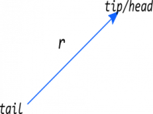
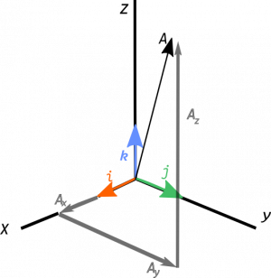
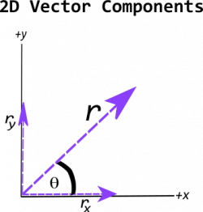
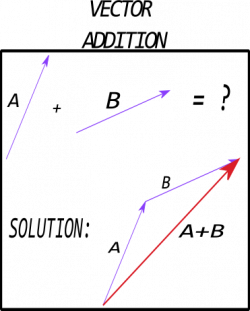
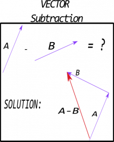

We often use mathematics to describe physical situations. Two types of quantities that are particularly important for describing physical systems are scalars and vectors. **In the notes below, you will read about those quantities (in general) and their properties.**

### Lecture Video



### Definitions & Diagrams

***Scalars** are quantities that can be represented by a single number. Typical examples include mass, volume, density, and speed.*

***Vectors** are quantities that have both a magnitude and direction. Typical examples include displacement, velocity, momentum, and force.*

Vectors are often represented with arrows. The end with the triangle is the “tip” or “head.” The other end is called the “tail.” The tail of a vector can be located anywhere; it is the difference between the tip and the tail that defines the vector itself. To the right is an example of a typical representation (a diagram) of a vector with the tip and tail labeled. We have no such diagrammatic representations for scalars.

## Defining Vectors Mathematically

 We define vectors in three dimensional space relative to some origin (where the tail of the vector is located). For example, a position vector $\overset{\rightarrow}{r}$ might defined relative to the origin of coordinates. The measures of the vector along the coordinate axes are called the vector's “components,” which can be positive or negative. Mathematically, a vector can be written with “bracket” notation:

$$
\mathbf{r} = \overset{\rightarrow}{r} = \langle r_{x},r_{y},r_{z}\rangle
$$

*where* $r_{x}$*,* $r_{y}$*, and* $r_{z}$ *are the vector components in the* $x$*,* $y$*, and* $z$ *direction respectively.* They tell you “how much” of the vector $\overset{\rightarrow}{r}$ is aligned with each coordinate direction. The vector itself is denoted either in bold face (in texts) or with an arrow above it (both texts and handwritten).

In physics, we often use the symbol $\overset{\rightarrow}{r}$ to represent the position vector, that is, the location of an object with respect to another point (e.g., the origin of coordinates).

### Length of a vector

The **magnitude** (or length) of a vector is a scalar quantity. Mathematically, we represent the magnitude of a vector like this:

$$
r = |\overset{\rightarrow}{r}| = \sqrt{r_{x}^{2} + r_{y}^{2} + r_{z}^{2}}
$$

This calculation simply uses the [Pythagorean theorem](https://en.wikipedia.org/wiki/Pythagorean_theorem) in three dimensions to determine this length.

### Unit vector

Any vector can be multiplied or divided by a scalar quantity. Often it is useful to divide a vector by its own magnitude. The result is the “unit vector.” **The unit vector** is a vector with length 1, but that points in the direction of the original vector. *The unit vector has no units* (e.g., the unit vector of a position vector with units of meters has no units itself). Mathematically, we represent the unit vector like this:

$$
\widehat{r} = \frac{\overset{\rightarrow}{r}}{|\overset{\rightarrow}{r}|} = \frac{\langle r_{x},r_{y},r_{z}\rangle}{\sqrt{r_{x}^{2} + r_{y}^{2} + r_{z}^{2}}}
$$

With the concept of a unit vector, any vector can be written as a product of its magnitude and its unit vector like this:

$$
\overset{\rightarrow}{r} = |\overset{\rightarrow}{r}|\widehat{r}
$$

While in physics we often represent vectors using bracket notation ($\overset{\rightarrow}{r} = \langle r_{x},r_{y},r_{z}\rangle$), other forms you might see in other courses could include coordinate unit vectors, for example:

$$
\overset{\rightarrow}{r} = r_{x}\widehat{x} + r_{y}\widehat{y} + r_{z}\widehat{z}
$$

$$
\overset{\rightarrow}{r} = r_{x}\widehat{i} + r_{y}\widehat{j} + r_{z}\widehat{k}
$$

$$
\overset{\rightarrow}{r} = r_{x}{\widehat{e}}_{1} + r_{y}{\widehat{e}}_{2} + r_{z}{\widehat{e}}_{3}
$$

These unit vectors point along usual [Cartesian coordinate directions](https://en.wikipedia.org/wiki/Cartesian_coordinate_system).

### Determining Vector Components in Two Dimensions

2D vector decomposition into components

Two dimensional vectors are easy to sketch, so often we will use them when describing different physical systems and problems. For these vectors, it is often useful to define an angle ($\theta$) between the vector and one of the coordinate directions (see the figure to the right). The typical relationship between the x and y components of a 2D vector and its magnitude and this angle (when defined from the positive x-axis) is:

$$
r_{x} = |\overset{\rightarrow}{r}|\cos\theta
$$

$$
r_{y} = |\overset{\rightarrow}{r}|\sin\theta
$$

*The above equations only work when the vectors are decomposed with along the x and y axis as defined in the figure to the right.* Oftentimes, an angle that is given or derived cannot make use of the simple decomposition formulae above. The geometric properties of the problem will dictate which trigonometric functions are used.



### Adding & Subtracting Vectors

Vector addition and subtraction can be done mathematically and graphically. Mathematically, vector addition and subtraction is done component by component like this:

$$
\overset{\rightarrow}{a} + \overset{\rightarrow}{b} = \langle a_{x},a_{y},a_{z}\rangle + \langle b_{x},b_{y},b_{z}\rangle = \langle a_{x} + b_{x},a_{y} + b_{y},a_{z} + b_{z}\rangle
$$

$$
\overset{\rightarrow}{a} - \overset{\rightarrow}{b} = \langle a_{x},a_{y},a_{z}\rangle - \langle b_{x},b_{y},b_{z}\rangle = \langle a_{x} - b_{x},a_{y} - b_{y},a_{z} - b_{z}\rangle
$$

 Graphically, vector addition and subtraction use the “tip-to-tail” method.

**Vector addition** For addition, place the tail of the second vector at the tip of the first vector. The vector that points from the tail of the first to the tip of the second is the sum or the “resultant” vector. The image to the right demonstrates this for two vectors, $\overset{\rightarrow}{a}$ and $\overset{\rightarrow}{b}$.

 **Vector subtraction** For subtraction, draw the vector that points directly opposite of the second vector. Place the tail of this reversed second vector at the tip of the first vector. The vector that points from the tail of the first to the tip of the reversed second is the difference vector. The image to the right demonstrates this for two vectors, $\overset{\rightarrow}{a}$ and $\overset{\rightarrow}{b}$.

## Examples

- 

<!-- -->

- 
