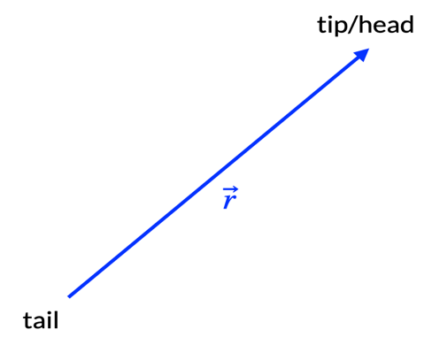
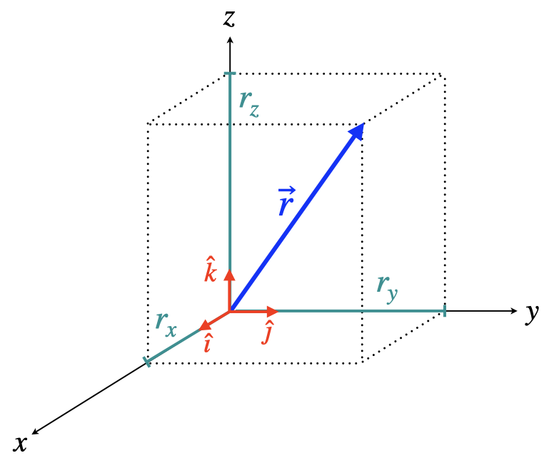
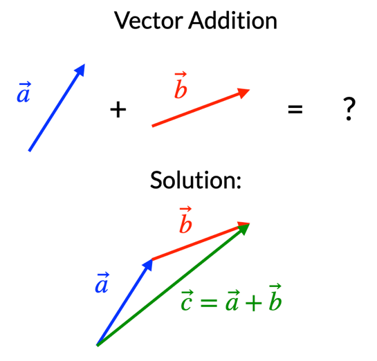
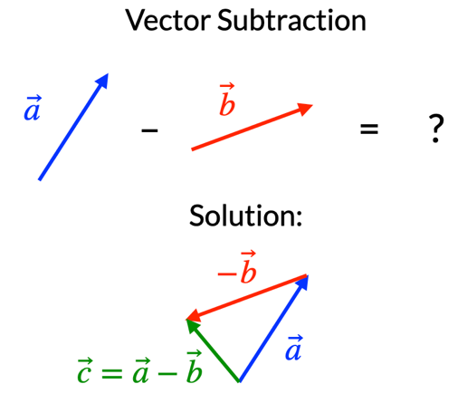
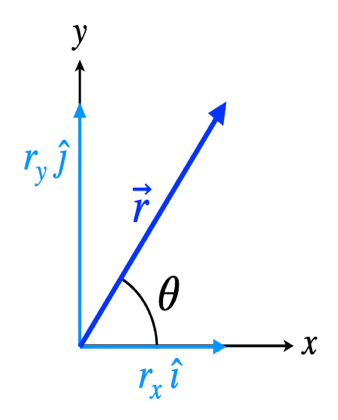

In this course we will use mathematics to describe and explain motion. Two types of mathematical quantities that are particularly important for describing physical systems are scalars and vectors. **In the notes below, you will read about those quantities (in general) and their properties.**

### Lecture Video



## Definitions & Diagrams

***Scalars*** are quantities that can be represented fully by a single number (possibly including units). Common examples include mass, volume, density, and speed.

***Vectors*** are quantities that intrinsically have ***both a magnitude and a direction***.  Typical examples include displacement ("5 meters to the left"), velocity ("moving upward at 3 m/s"), momentum, and force.  Describing objects moving in 3D space generally requires using vectors.

Vectors are often represented with arrows. The end with the triangle is the “tip” or “head.” The other end, where the vector starts, is called the “tail.”  It doesn’t matter where the tail is located; it is the *difference* between the tip and the tail that defines the vector.  (There is no such diagrammatic representation for scalars, since they are just plain numbers.)

# Mathematical Operations on Vectors

We define vectors in three-dimensional space relative to some origin (where the tail of the vector is located). For example, a position vector $\overrightarrow{r}$ might be defined relative to the origin of coordinates. The measures of the vector along the coordinate axes are called the vector's “components,” which can be positive or negative. Mathematically, a vector can be written with “bracket” notation:

$$
\overrightarrow{r} = \left\langle r_{x},r_{y},r_{z} \right\rangle
$$

where $r_{x}$, $r_{y}$, and $r_{z}$ are called the vector *components* in the $x$, $y$, and $z$ directions, respectively. They tell you how much of vector $\overrightarrow{r}$ points along each coordinate direction: a vector that is purely along the *y* axis has zero *x* and *z* components, for example. A variable with an arrow above it indicates a vector (or sometimes boldface is used in textbooks).

In physics, we often use the symbol $\overrightarrow{r}$ to represent the position vector, that is, the location of an object with respect to another point (e.g., the origin of coordinates).

## Magnitude of a Vector

The **magnitude**, or length, of a vector is a scalar quantity. (“Magnitude” is a Latin term that just means how big something is, like the magnitude of an earthquake.) It can be denoted by the vector's symbol without an arrow, or by putting the vector in absolute value bars. Mathematically, we use the [Pythagorean theorem](https://en.wikipedia.org/wiki/Pythagorean_theorem) to calculate the length, treating the arrow as the hypotenuse of a triangle:

$$
r = \left| \overrightarrow{r} \right| = \sqrt{r_{x}^{2} + r_{y}^{2} + r_{z}^{2}}
$$

## Multiplication and Division

Any vector can be multiplied or divided by a scalar quantity, which multiplies each component independently:

$$
A\overrightarrow{r} = \left\langle Ar_{x},Ar_{y},Ar_{z} \right\rangle
$$

The magnitude of the resulting vector is the original magnitude times the scalar:\
$\left| A\overrightarrow{r} \right| = A\left| \overrightarrow{r} \right|$. Multiplying by a negative number will reverse the direction of each component, so that the vector points in exactly the opposite direction.   

*These formulae are only for multiplying a vector by a scalar.*  Multiplying vectors by other vectors is more complicated, and we'll look at that later.

## Unit Vectors

Often it is useful to divide a vector by its own magnitude. The result is called a *unit vector*, denoted by the vector's symbol under a ^ (“hat”) rather than an arrow.  The unit vector is **a vector with length 1**, but which points in the direction of the original vector: it represents just the direction, leaving the magnitude information behind. The unit vector has no units (e.g., the unit vector of a position vector with units of meters has no units itself; the units are part of the magnitude).

By definition, any vector can be written as the product of its magnitude and its unit vector: $\overrightarrow{r} = \left| \overrightarrow{r} \right|\ \widehat{r}.$

Mathematically, we can compute the unit vector by dividing each component by the magnitude $\left| \overrightarrow{r} \right| = \sqrt{r_{x}^{2} + r_{y}^{2} + r_{z}^{2}}$ of the full vector:

$$
\widehat{r} = \frac{\overrightarrow{r}}{\left| \overrightarrow{r} \right|} = \frac{1}{\left| \overrightarrow{r} \right|}\left\langle r_{x},r_{y},r_{z} \right\rangle = \left\langle \ \frac{r_{x}}{\left| \overrightarrow{r} \right|},\ \frac{r_{y}}{\left| \overrightarrow{r} \right|},\ \frac{r_{z}}{\left| \overrightarrow{r} \right|}\  \right\rangle
$$

The unit vectors associated with coordinate axes are sometimes given special symbols, so you may see $\left( \widehat{x},\widehat{y},\widehat{z} \right)$, $\left( \widehat{\imath},\widehat{\jmath},\widehat{k} \right)$, or $\left( {\widehat{e}}_{1},{\widehat{e}}_{2},{\widehat{e}}_{3} \right).$ All of these forms mean the same thing: the unit vectors pointing along the positive $x,y,$ and $z$ axes.

## Adding and Subtracting Vectors

Vector addition and subtraction can be done mathematically or graphically. Mathematically, vector addition and subtraction work component by component:

$$
\overrightarrow{a} + \overrightarrow{b} = \left\langle a_{x},a_{y},a_{z} \right\rangle + \left\langle b_{x},b_{y},b_{z} \right\rangle = \left\langle a_{x} + b_{x},a_{y} + b_{y},a_{z} + b_{z} \right\rangle
$$

$$
\overrightarrow{a} - \overrightarrow{b} = \left\langle a_{x},a_{y},a_{z} \right\rangle - \left\langle b_{x},b_{y},b_{z} \right\rangle = \left\langle a_{x} - b_{x},a_{y} - b_{y},a_{z} - b_{z} \right\rangle
$$

(You can think of any vector equation as representing multiple copies of the same equation, one for each component.)

Graphically, vector addition and subtraction use the “tip-to-tail” method:

**Vector addition**:  You can think of vector addition as a series of steps taken in sequence.  Graphically, place the starting point (the tail) of the second vector at the end (the tip) of the first vector. The vector that points from the start (tail) of the first to the end (tip) of the second is the sum, or “resultant,” vector. The image below demonstrates this for two vectors, $\overrightarrow{a}$ and $\overrightarrow{b}$.

**Vector subtraction**:  Subtraction is like addition, but you reverse the direction of the second vector (multiplying by -1 reverses the direction of a vector).  Draw the vector that points directly opposite of the second vector. Place the start (tail) of this reversed second vector at the end (tip) of the first vector. The vector that points from the tail of the first to the tip of the reversed second is the difference vector. The image below demonstrates this for two vectors, $\overrightarrow{a}$ and $\overrightarrow{b}$.

# Determining Vector Components in Two Dimensions

Two-dimensional vectors are easy to sketch, so often we will use them when describing different physical systems and problems. For these vectors, it is often useful to define an angle (θ) between the vector and one of the coordinate directions (see the figure to the right). The typical relationship between the x and y components of a 2D vector and its magnitude and this angle (<u>*when defined* *counter-clockwise from the positive x-axis*</u>) is

$$
r_{x} = \left| \overrightarrow{r} \right|\cos\theta
$$

$$
r_{y} = \left| \overrightarrow{r} \right|\sin\theta
$$

*The above equations only work when the vectors are decomposed along the x and y axes and **the angle is defined as in the figure*** *at right*.  Often, an angle that is given or derived is defined differently, and then you cannot make use of the simple decomposition formulae above but need to work out the trigonometric relationships from scratch (using "sohcahtoa").  



# Example Problems

[Calculating a unit vector](/examples/unitvector/)

[Determining vector components](/examples/vectordecomposition/)

# Vector Simulation

Here is a [link](https://phet.colorado.edu/sims/html/vector-addition/latest/vector-addition_all.html) to an online simulation that lets you play with vectors in 2D. Credit: PhET team, University of Colorado.
