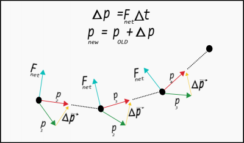

You read earlier [how to predict the motion of a system that experiences a constant force](/notes/week-02-modeling-motion-net-force/constantf/). *However, very few real systems can be approximately modeled using constant force motion.*

All systems can be modeled iteratively, that is, applying the motion prediction tools ([momentum update](/notes/week-02-modeling-motion-net-force/motionpredict/) and [position update](/notes/week-01-modeling-motion-no-net-force/displacement_and_velocity/)) in repeated small steps. In these notes, you will read about this iterative process and how it is related to formal calculus.

### Lecture Video



### The Concept of Iterative Prediction

“Iterate” means to “repeat.” In physics, it often means to perform the same calculation repeatedly using information produced by the previous calculation. You might think of this as taking the output of a calculation and using it as the input for the new calculation.

To predict motion iteratively is to apply the [momentum update](/notes/week-02-modeling-motion-net-force/motionpredict/) and [position update](/notes/week-01-modeling-motion-no-net-force/displacement_and_velocity/) formula over small time steps, using their own predictions and the inputs for the next calculation. The steps for iteratively prediction motion are as follows:

- 1.) - Calculate the (vector) forces acting on the system.
- 2.) - Update the momentum of the system: ${\overset{\rightarrow}{p}}_{f} = {\overset{\rightarrow}{p}}_{i} + {\overset{\rightarrow}{F}}_{net}\Delta t$.
- 3.) - Update the position of the system: ${\overset{\rightarrow}{r}}_{f} = {\overset{\rightarrow}{r}}_{i} + {\overset{\rightarrow}{v}}_{avg}\Delta t$.
- 4.) - Repeat

This process can be used for any system with any type of force. The accuracy of your predictions depend on the length of the time step. *By using this method, you assume that the net force and average velocity are roughly constant over the time interval (for each time interval).* If you are interested in more details, this method is similar to [Euler-Cromer symplectic integration](http://en.wikipedia.org/wiki/Semi-implicit_Euler_method).

### Applying Iterative Prediction

To reiterate, this method is not limited to non-constant forces and can be used to predict the motion in situations where a constant force model can be applied. A visual representation of such an iterative prediction over 3 steps is shown below. In each step, the momentum changes and, thus, the new momentum is calculated. This new momentum is used to determine the new location of the ball. The process is executed again with an updated prediction. 

If you were to connect the straight lines in this picture, you would see a trajectory that looks more like moving through a curved trajectory. *The time step here is quite long for the motion, but using a shorter time step, the line segments are shorter and more closely produce a curved trajectory.*

## Examples

[predicting_the_motion_of_system_subject_to_a_spring_interaction](https://www.msuperl.org/wikis/pcubed/doku.php?id=183_notes:examples:predicting_the_motion_of_system_subject_to_a_spring_interaction)
