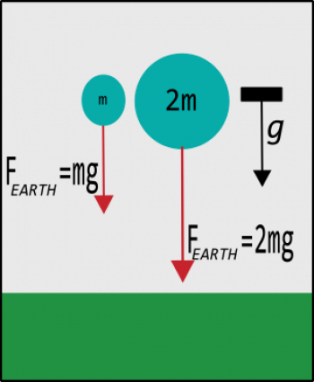

You've read that the [net force acting on an systems will change the system's momentum](/notes/week-02-modeling-motion-net-force/momentum_principle/), but until now you haven't considered any particular forces. The first force that you will consider is the one that results from the interaction between objects with mass: [the gravitational force](http://en.wikipedia.org/wiki/Gravity).

*For now, you will consider only the motion of systems near the surface of the Earth. Near the surface of the Earth, we observe that the gravitational force is a constant vector.*[1)](/notes/week-02-modeling-motion-net-force/localg/#fn__1) Later, you will find that the gravitational force near the surface of the Earth is an approximation to the more general description of [the gravitational force between objects](/notes/week-03-newtonian-gravitation/gravitation/).

### Lecture Video



### The Gravitational Acceleration

Countless experiments near the surface of the Earth have shown that the force that the Earth exerts on a system with mass is the product of the system's mass ($m$) and the local gravitational acceleration ($\overset{\rightarrow}{g}$).where we have defined “up” as positive $y$-direction and the magnitude of the gravitational acceleration ($g$) is equal to **9.81** $\frac{m}{s^{2}}$**.**

Mathematically, we represent this force like this:

$$
{\overset{\rightarrow}{F}}_{Earth} = m\overset{\rightarrow}{g}
$$

where the local gravitational acceleration is directed towards the center of the Earth. In your typical “flat-Earth” models,[2)](/notes/week-02-modeling-motion-net-force/localg/#fn__2) you will say the gravitational acceleration points “downward”, which we typically consider to be the negative $y$-direction. In this case,

$$
\overset{\rightarrow}{g} = \langle 0, - g,0\rangle \approx \langle 0, - 9.81,0\rangle\frac{m}{s^{2}}
$$

We also accept some variation in $\overset{\rightarrow}{g}$ from [place to place](http://en.wikipedia.org/wiki/Gravity_anomaly).

The figure on the right represents a typical [force body diagram](https://en.wikipedia.org/wiki/Free_body_diagram) for two systems falling near the surface of the Earth (where we have neglected any interactions due to the air). Notice that while the two systems experience different forces, they experience the [same acceleration](/notes/week-02-modeling-motion-net-force/acceleration/).

### Motion of Systems Due to Near-Earth Gravitational Forces

As you have read, the [motion of a system depends on the net force](/notes/week-02-modeling-motion-net-force/momentum_principle/) acting on that system. If you can reasonably assume that a system interacts solely with the Earth such that the only force acting on that system is the local gravitational force, then the net force on that system is just the gravitational force. The motion of such a system is independent of the mass of the system.

The momentum of the system changes through the momentum principle, but the motion (how the position of the system changes) only depends on how the velocity changes. When the system only interacts with the Earth, this velocity change only depends on the gravitational acceleration. This can be summarized mathematically like this:

$$
\Delta\overset{\rightarrow}{p} = {\overset{\rightarrow}{F}}_{net}\Delta t = {\overset{\rightarrow}{F}}_{Earth}\Delta t = m\overset{\rightarrow}{g}\Delta t
$$

$$
\Delta\overset{\rightarrow}{v} = \frac{\Delta\overset{\rightarrow}{p}}{m} = \frac{{\overset{\rightarrow}{F}}_{Earth}}{m}\Delta t = \overset{\rightarrow}{g}\Delta t
$$

These algebraic manipulations produce a single “kinematic” equation[3)](/notes/week-02-modeling-motion-net-force/localg/#fn__3) that can be used to predict the future velocity of the system (${\overset{\rightarrow}{v}}_{f}$) after some time ($\Delta t$) given information about its current velocity (${\overset{\rightarrow}{v}}_{i}$),

$$
{\overset{\rightarrow}{v}}_{f} = {\overset{\rightarrow}{v}}_{i} + \overset{\rightarrow}{g}\Delta t
$$

[Through some additional manipulation](/notes/week-02-modeling-motion-net-force/constantf/), you can derive an equation that predicts the location of a system that interacts solely with the Earth,

$$
{\overset{\rightarrow}{r}}_{f} = {\overset{\rightarrow}{r}}_{i} + {\overset{\rightarrow}{v}}_{i}\Delta t + \frac{1}{2}\overset{\rightarrow}{g}\Delta t^{2}
$$

When we choose the +$y$-direction to be up from the surface of the Earth, the gravitational acceleration is given by $\overset{\rightarrow}{g} = \langle 0, - 9.8,0\rangle\frac{m}{s}$. This leads you to a set of 4 kinematic equations, which you might be familiar from other courses, that describe the motion of a system that can be reasonably assumed to experience just the gravitational interaction.

$$
v_{f,x} = v_{i,x}
$$

$$
v_{f,y} = v_{i,y} - g\Delta t
$$

$$
x_{f} = x_{i} + v_{i,x}\Delta t
$$

$$
y_{f} = y_{i} + v_{i,y}\Delta t - \frac{1}{2}g\Delta t^{2}
$$

#### When are these equations useful?

*The previous two equations[4)](/notes/week-02-modeling-motion-net-force/localg/#fn__4) imply that the motion of objects near the surface of the Earth is independent of the mass of the object (provided you can neglect other forces)*. They are the basis for [analyzing the motion of projectiles](http://en.wikipedia.org/wiki/Projectile_motion). But are they actually useful?

Galileo was the first to predict that the motion of objects near the Earth (where the Earth is the sole interaction) was independent of the mass of the object. His [supposed experiments at the Leaning Tower of Pisa](http://en.wikipedia.org/wiki/Galileo's_Leaning_Tower_of_Pisa_experiment) confirmed these predictions and helped to reject the [current thinking at the time, which was due to Aristotle](https://en.wikipedia.org/wiki/Aristotelian_physics).

Many years later, Apollo 15 astronaut [David Scott](http://en.wikipedia.org/wiki/David_Scott) dropped a hammer and a feather on the moon where [the atmosphere is so thin, it can be considered to be vacuum](http://en.wikipedia.org/wiki/Atmosphere_of_the_Moon). They hit the ground at the same time, confirming that for systems where the motion is due solely to interactions with the gravitational force near the surface of the Earth, mass doesn't matter – all objects have the same motion. Below is a video of Scott's famous experiment.



So, when you can reasonably assume that the major interaction between the system and the surroundings is the gravitational interaction with the Earth, these equations can be useful for getting a decent idea of the motion of the system.

## Examples

- [Finding the time of flight of a projectile](/pcubed/examples/finding_the_time_of_flight_of_a_projectile/)
- [Finding the range of projectile](/pcubed/examples/finding_the_range_of_projectile/)

------------------------------------------------------------------------

[1)](/notes/week-02-modeling-motion-net-force/localg/#fnt__1)

This is mostly true. There are small variations due to changes in the density of the Earth's crust in different regions. These [gravitational anamolies](http://en.wikipedia.org/wiki/Gravity_anomaly) were mapped by the [GRACE experiment](http://en.wikipedia.org/wiki/Gravity_Recovery_and_Climate_Experiment).

[2)](/notes/week-02-modeling-motion-net-force/localg/#fnt__2)

By “flat-Earth”, I mean [the distance over which the Earth is curved is much larger than any distance the system will travel](http://en.wikipedia.org/wiki/Geographical_distance#Flat-surface_formulae) not that [the Earth is truly flat as some might think](https://en.wikipedia.org/wiki/Modern_flat_Earth_societies).

[3)](/notes/week-02-modeling-motion-net-force/localg/#fnt__3)

This equation and equations like it that do not explicitly contain forces are called “kinematic equations” because only need observational quantities to make predictions. That is, they don't need information about the “dynamics.”

[4)](/notes/week-02-modeling-motion-net-force/localg/#fnt__4)

Notice that these equations are identical to the [constant force motion equations](/notes/week-02-modeling-motion-net-force/constantf/) with the gravitational force plugged in for ${\overset{\rightarrow}{F}}_{net}$.
