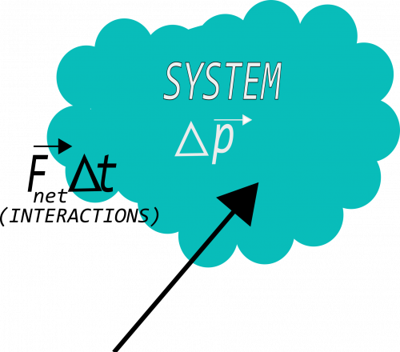

The motion of a system is governed by the **Momentum Principle**. This principle describes how a system changes its motion when it experiences a net force. *We observe that when objects move in a straight line at constant speed they experience no net force.* This observation is critical to our understanding of motion (This observation is often called ["Newton's First Law of Motion"](https://en.wikipedia.org/wiki/Newton's_laws_of_motion#Newton.27s_first_law)).

In these notes, you will be introduced to the idea of a system, net force, and how a system's momentum and the net force it experiences are related (i.e., through ["Newton's Second Law of Motion"](https://en.wikipedia.org/wiki/Newton%27s_laws_of_motion#Newton.27s_second_law)). In another set of notes, you find a few useful formula for when the net force acting on a system is a constant vector (fixed magnitude and direction).

### Lecture Video



### System and Surroundings

*You can consider a single object or a collection of objects to be a “system.”* Anything that you choose to not be in your system exists in the “surroundings.” In mechanics, you will choose systems by considering what objects you want to predict or explain the motion of. That is, the choice of system is arbitrary to the extent that you only care about predicting or explaining the motion of objects in your system.

*Through interactions with the surroundings, systems can change their momentum, energy, angular momentum, and entropy.* For the time being, you will work with systems that consist of a single-particle, and you will consider only how single particles change their momentum.

#### An Example: A fan cart changing its momentum

Consider the video below where a fan cart is released from rest and moves to the right.



If we choose the system to be the fan cart, you can observe that the momentum of that system changes (the fan cart [accelerates](/notes/week-02-modeling-motion-net-force/acceleration/) to the right). This is due to the interaction between the air (surroundings) and the fan blades (part of the system), namely, that the air exerts a force on the fan blades. As a result, the fan cart increases its momentum.

### The Momentum Principle

*The Momentum Principle is one of [three fundamental principles of mechanics](/notes/week-15-core-principles/fundamental_principles/) and is also known as ["Newton's Second Law of Motion"](https://en.wikipedia.org/wiki/Newton's_laws_of_motion#Newton.27s_2nd_Law)*. No matter what system you choose the Momentum Principle will correctly predict the motion of that system. It is the quantitative form of Newton's First Law; it tells you precisely how the momentum (and thus the velocity) of an system will evolve when it experiences a net force.

If a system experiences a net force, it can experience either:

- a change in the magnitude of its momentum,
- a change in the direction of its momentum, or
- a simultaneous change in the magnitude and the direction of its momentum

Mathematically, the Momentum Principle states:

$$
\Delta\overset{\rightarrow}{p} = {\overset{\rightarrow}{p}}_{f} - {\overset{\rightarrow}{p}}_{i} = {\overset{\rightarrow}{F}}_{net,avg}\Delta t
$$

which you can think of as **the change in a system's momentum = the average net force acting on the system multiplied by the time interval over which the net force acts**. In this formulation of the Momentum Principle, it must be that the time interval over which the net force acts is sufficiently small that the net force is can be approximated as constant. This is why this net force in this principle is the average net force. Notice that this is a vector principle.

If you divide both sides of this version of the Momentum Principle by this time interval ($\Delta t$) and take the limit as the time interval goes to zero, ($\Delta t \rightarrow 0$), you obtain the exact definition of the net force acting on the system at any instant,

$$
\lim_{\Delta t \rightarrow 0}\frac{\Delta\overset{\rightarrow}{p}}{\Delta t} = {\overset{\rightarrow}{F}}_{net,avg} \rightarrow {\overset{\rightarrow}{F}}_{net} = \frac{d\overset{\rightarrow}{p}}{dt}
$$

### Net Force

**A force** is a vector that quantifies the interactions between two objects. The units of force in SI are **Newtons (N)**. 1 Newton is equal to 1 kilogram-meter-per-second squared (1 N = 1 $\frac{kg\ m}{s^{2}}$).

There are two types of forces that you will work with in mechanics: [gravitational forces](/notes/week-03-newtonian-gravitation/gravitation/) and electrostatic forces. As you will learn, all interactions that you will consider in mechanics are a result of objects either having mass and, thus, attracting gravitationally, or being charged, and thus, interacting through electrical repulsion or attraction.

Systems might interact with several objects in their surroundings, and thus, experience a variety of forces. Fortunately to make predictions of the motion, the Momentum Principle only requires that you know the net force.

The **Net Force** is the vector sum of *all forces* acting (at an instant) on a system as due to the systems' surroundings.

Mathematically, we can represent this sum using vector notation:

$$
{\overset{\rightarrow}{F}}_{net} = {\overset{\rightarrow}{F}}_{1} + {\overset{\rightarrow}{F}}_{2} + {\overset{\rightarrow}{F}}_{3} + \ldots
$$

where each interaction/force (at an instant) is counted as a specific ${\overset{\rightarrow}{F}}_{i}$. These interactions may be “field interactions” (e.g., [the gravitational field](/notes/week-03-newtonian-gravitation/gravitation/)) or “contact interactions” (e.g., the [normal force](/notes/week-04-05-springs-contact-interactions/friction/#the_normal_force) or the [frictional force](/notes/week-04-05-springs-contact-interactions/friction/#friction)). [Contact interactions](/notes/week-04-05-springs-contact-interactions/friction/) are the result of the electromagnetic field and are, thus, truly field interactions (as all interactions are).

#### Impulse

**Impulse** is the product of a force and a time interval over which that force acts, which is mathematically equivalent to the change in momentum (Impulse = $\overset{\rightarrow}{J} \equiv \overset{\rightarrow}{F}\Delta t$).

Sometimes, you might find it useful to think about *the impulse applied to a system as being responsible for the change in momentum of the system.* An impulse may be calculated for each force (e.g., *impulse delivered by the gravitational force*) or the total force (i.e., *the “net” impulse applied to the system*).

## Examples

- [Calculating the net force](/examples/netforce/)
- [Calculating the change in momentum](/examples/impulse/)
