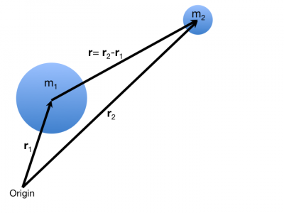

Earlier, you read about [Newton's Universal Law of Gravitation](/notes/week-03-newtonian-gravitation/gravitation/) or, rather, the model we use to describe the gravitational interaction between two objects with mass. In these notes, you will read about how the gravitational acceleration of system depends only on the system that attracts it and the relative position of the systems.

## The Gravitational Force and the Momentum Principle

As you read [earlier](/notes/week-03-newtonian-gravitation/gravitation/), the gravitational force between two objects with mass is given by the vector expression:

$$
{\overset{\rightarrow}{F}}_{grav} = - G\frac{m_{1}m_{2}}{|\overset{\rightarrow}{r}|^{2}}\widehat{r}
$$

where object 1 has mass, $m_{1}$, and object 2 has mass, $m_{2}$. If the separation vector ($\overset{\rightarrow}{r}$) describes the relative position of object 2 with respect to object 1 (as shown in the figure to the right):

$$
\overset{\rightarrow}{r} = {\overset{\rightarrow}{r}}_{2} - {\overset{\rightarrow}{r}}_{1}
$$

then the force expression above describes the force that object 1 exerts on object 2. You can use [The Momentum Principle](/notes/week-02-modeling-motion-net-force/momentum_principle/) to determine the [acceleration](/notes/week-02-modeling-motion-net-force/acceleration/) of object 2 as a result of the gravitational force exerted by object 1[1)](/notes/week-03-newtonian-gravitation/grav_accel/#fn__1).

$$
{\overset{\rightarrow}{F}}_{net,2} = \frac{\Delta{\overset{\rightarrow}{p}}_{2}}{\Delta t} = {\overset{\rightarrow}{F}}_{grav,2}
$$

Using the formula for each force, we find:

$$
\frac{\Delta{\overset{\rightarrow}{p}}_{2}}{\Delta t} = m_{2}\frac{\Delta{\overset{\rightarrow}{v}}_{2}}{\Delta t} = m_{2}{\overset{\rightarrow}{a}}_{2} = - G\frac{m_{1}m_{2}}{|\overset{\rightarrow}{r}|^{2}}\widehat{r}
$$

We then divide the mass of the object 2 out ($m_{2}$):

$$
{\overset{\rightarrow}{a}}_{2} = - G\frac{m_{1}}{|\overset{\rightarrow}{r}|^{2}}\widehat{r}
$$

*The resulting expression is the acceleration that object 2 experiences due to it's gravitational interaction with object 1*. Notice that the acceleration of object 2 depends only on the mass of object 1 ($m_{1}$), and relative position of object 2 with respect to object 1 ($\overset{\rightarrow}{r}$). It also points towards object 1, which indicates that the object 2 is attracted (and will thus experience an acceleration along the line between object 1 and 2).

So, *in general*:

$$
\overset{\rightarrow}{a} = - G\frac{m}{|\overset{\rightarrow}{r}|^{2}}\widehat{r}
$$

Sometimes, it's useful to think of this acceleration occurring in a single dimension (e.g., along the line that connects object 1 and object 2). Let's take that line to line in the $x$-direction. In that case, the expression for the magnitude of the acceleration in $x$-direction is given by:

$$
a_{x} = - G\frac{m}{x^{2}}
$$

where the object with mass $m$ is the one that exerts the force on the mass in question (i.e., the object experiencing the acceleration) and $x$ is the distance between the objects.

## The Local Gravitational Acceleration revisited

Earlier you read that the [local gravitational acceleration](/notes/week-02-modeling-motion-net-force/localg/) was given by $\overset{\rightarrow}{g} \approx \langle 0, - 9.81,0\rangle m/s$ or, rather that the magnitude of the acceleration was $g \approx 9.81m/s.$ It turns out this value can be predicted by Newton's model for gravitational interactions, which demonstrates that the force that keeps us grounded on Earth is the very same force that hold [planets in orbit](http://en.wikipedia.org/wiki/Solar_System) and is responsible for the [formation of stars](http://en.wikipedia.org/wiki/Star_formation).

For simplicity, let's take the downward vertical direction to be positive. Let's compute the acceleration due gravity at the surface of the Earth. Here the [mass of the Earth](http://lmgtfy.com/?q=mass+of+the+earth) is roughly $5.97 \times 10^{24}kg$ and [the radius of the Earth](http://lmgtfy.com/?q=radius+of+the+earth) is $6.38 \times 10^{6}m$.

$$
a_{y} = G\frac{M_{Earth}}{R_{Earth}^{2}} = \left( 6.67384 \times 10^{- 11}\frac{m^{3}}{kg\ s^{2}} \right)\left( \frac{5.97 \times 10^{24}\ kg}{(6.38 \times 10^{6}\ m)^{2}} \right) = 9.80\frac{m}{s^{2}}
$$

which is pretty close to the value we often use. In fact, the gravitational acceleration fluctuates a few percent over the surface of the Earth due to [gravitaitonal anomalies](http://en.wikipedia.org/wiki/Gravity_anomaly). The variations in the Earth's crust that are primarily responsible for these anomalies were mapped by the [GRACE Experiment](http://en.wikipedia.org/wiki/Gravity_Recovery_and_Climate_Experiment).

------------------------------------------------------------------------

[1)](/notes/week-03-newtonian-gravitation/grav_accel/#fnt__1)

In this case, we assume that there are no other interactions that object 2 experiences.
