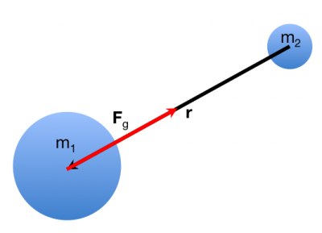
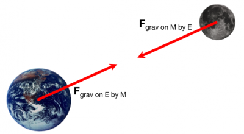

Earlier, you read about the [gravitational force near the surface of the Earth](/notes/week-02-modeling-motion-net-force/localg/). This [force was constant](/notes/week-02-modeling-motion-net-force/constantf/) and *was always directed “downward”* (or rather toward the center of the Earth). In these notes, you will read about Newton's formulation of the gravitational force that (in his day) helped explain the motion of the solar system including why the Sun was at the center of the solar system.

### Lecture Video



### The Gravitational Force

Using a number of empirical observations (by [Tycho Brahe](http://en.wikipedia.org/wiki/Tycho_Brahe) and [Johannes Kepler](http://en.wikipedia.org/wiki/Johannes_Kepler)) of the motion of various astronomical objects, [Isaac Newton](http://en.wikipedia.org/wiki/Isaac_Newton) was able to develop an empirical formula for the interactions of the those objects that could predict the future (and explain the past) motion of those objects. This formula became known as [Newton's Universal Law of Gravitation](http://en.wikipedia.org/wiki/Newton's_law_of_universal_gravitation). We will refer to it as the **Model of the Gravitational Force** [1)](/notes/week-03-newtonian-gravitation/gravitation/#fn__1).

Newton found that the interaction between two objects with mass is attractive, directly proportional to the product of their masses, inversely proportional to the square of their separation, and directed along the line between their centers. The figure to the right illustrates the force that planet 2 exerts on planet 1.

To be explicit, consider the vector ($\overset{\rightarrow}{r}$) *that points from planet 2 to planet 1*. If the location of planet 1 relative to the origin is ${\overset{\rightarrow}{r}}_{1}$ and the location of planet 2 relative to the same origin is ${\overset{\rightarrow}{r}}_{2}$, then this relative position or *separation vector* can be mathematically represented like this:

$$
\overset{\rightarrow}{r} = {\overset{\rightarrow}{r}}_{1} - {\overset{\rightarrow}{r}}_{2}
$$

The **separation** vector is represented by the black arrow in the figure to the right. *The length of this separation vector (*$|\overset{\rightarrow}{r}|$*) is the how far apart the two planets are. The [unit vector](/notes/week-01-modeling-motion-no-net-force/scalars_and_vectors/) that points from planet 2 to planet 1 is given by,*

$$
\widehat{r} = \frac{\overset{\rightarrow}{r}}{|\overset{\rightarrow}{r}|}
$$

With these vectors written, you can now write down Newton's model of the gravitational force from the description above,

$$
{\overset{\rightarrow}{F}}_{grav} = - G\frac{m_{1}m_{2}}{|\overset{\rightarrow}{r}|^{2}}\widehat{r}
$$

where $G$ is a *constant of proportionality that characterizes the strength of the gravitational force*. This force is represented by the red arrow in the figure to the right. In SI units, $G = 6.67384 \times 10^{- 11}\frac{m^{3}}{kg\ s^{2}}$.

#### Why the minus sign?

*The gravitational force is an attractive force*. That is, two objects that interact gravitationally *are attracted* to each other. The gravitational force formula uses the separation vector ($\overset{\rightarrow}{r}$) that points from the object that exerts the force to the object that experiences the force. For example, in the figure above, $m_{2}$ exerts the force on $m_{1}$, so the separation vector points from $m_{2}$ to $m_{1}$ (black arrow in the figure above).

But, the force that $m_{1}$ experiences is directed towards $m_{2}$; it is attracted towards $m_{2}$. The minus sign ensures that the force (red arrow in the figure above) points in this direction.

### Newton's 3rd Law

The gravitational force the Earth exerts on the Moon is the same magnitude as the gravitational force the Moon exerts on the Earth.

The gravitational force provides the first example of [Newton's 3rd Law](http://en.wikipedia.org/wiki/Newton's_laws_of_motion#Newton.27s_third_law), which you might have heard colloquially as “For every action, there is an equal and opposite reaction.” Unfortunately, [this colloquialism is a terribly inaccurate definition](http://www.wired.com/2013/10/a-closer-look-at-newtons-third-law/) that gets applied incorrectly quite often, [even by the Mythbusters](http://scienceblogs.com/dotphysics/2010/05/06/mythbusters-energy-explanation/)!

Newton's 3rd Law results from the idea that a [force quantifies the interaction between two objects](/notes/week-02-modeling-motion-net-force/momentum_principle/#net_force). You can also think of it as an empirical fact, which stems from our definition of force. That is, **we observe when one object exerts a force on another object, the second object exerts a force on the first object of the same size but opposite in direction.**

To be more concrete, you can think about the gravitational interaction between the Earth and the moon (shown in the figure below). The magnitude of these gravitational forces are the same (see the equation above), but the vector direction for each always points directly towards the other object.

We will find other examples of Newton's 3rd Law pairs when you learn about [contact interactions](/notes/week-04-05-springs-contact-interactions/friction/). When we discuss contact interactions, it turns out, these are the result of the electrostatic force.

#### If the forces are the same size, why isn't the motion the same?

The motion of systems is governed by the [Momentum Principle](/notes/week-02-modeling-motion-net-force/momentum_principle/). In this case, you might find it useful to think about the [acceleration of the system](/notes/week-02-modeling-motion-net-force/acceleration/), which tells you how the velocity of the system changes. While the Earth and Moon experience the same size gravitational force, the small mass of the Moon (compared to the Earth) results in a much larger acceleration for the Moon, and this change in the Moon's velocity is large (compared to the Earth's).

#### Acceleration due to the gravitational force

Consider a person ($m_{person}$) who is standing on the surface of the Earth ($R_{Earth}$ from the center of the Earth). The magnitude of the force acting on either the person due to the Earth or on the Earth due to the person is the same size, namely,

$$
|F_{grav}| = G\frac{m_{person}M_{Earth}}{R_{Earth}^{2}}
$$

where $|F_{grav}|$ is simply the magnitude of the gravitational force. If you want to find the magnitude of the acceleration that the person experiences as a result of the gravitational force, simply divide the above equation by the mass of the person (i.e., $a = F/m$ for the net force),

$$
|a_{person}| = \frac{|F_{grav}|}{m_{person}} = G\frac{M_{Earth}}{R_{Earth}^{2}}
$$

This acceleration is fully defined by known quantities (i.e., $G$, $M_{Earth}$, and $R_{Earth}$) and turns out to give the [Near-Earth Gravitational acceleration](/notes/week-03-newtonian-gravitation/grav_accel/) ($g = 9.81\frac{m}{s^{2}}$). If instead, you are interested in the acceleration the Earth experiences due to the person, you divide by the mass of the Earth (a mass that is $10^{22}$ times larger than the person's mass),

$$
|a_{Earth}| = \frac{|F_{grav}|}{M_{Earth}} = G\frac{m_{person}}{R_{Earth}^{2}}
$$

Thus, the acceleration that the Earth would experience due a single person is about 0.0000000000000000000001\*$g$! This value is *incredibly small*; we often neglect changes in the motion of the Earth due to objects that are not astronomically large. In these notes, the [vector acceleration due to gravitational interactions is calculated explicitly](/notes/week-03-newtonian-gravitation/grav_accel/).

### (More) Modern Gravitational Models

Newton's model of the gravitational force was considered one of the simplest and most explanatory models for many years. We have since made observations that no longer fit with Newton's model (e.g., [Gravitational lensing](http://en.wikipedia.org/wiki/Gravitational_lens)). Our best model for gravitation, which observations continue to fit, is called ["general relativity"](http://en.wikipedia.org/wiki/General_relativity) (GR) and was developed by [Albert Einstein](http://en.wikipedia.org/wiki/Albert_Einstein). While this model provides us with far better predictions and explanations of a variety of observations, we still use Newton's model of the gravitational force for two reasons: (1) *it can provide reasonable predictions for many cases*, and (2) *[the mathematics that is used in GR](https://en.wikipedia.org/wiki/Mathematics_of_general_relativity) is sufficiently sophisticated that you will need more physics and mathematics experience to gain deep insight into its use.*

## Examples

- [Calculating the Gravitational Force](/pcubed/examples/calcgravforce/)
- [Video Example: Gravitational force and Kinematic equations on the Moon](/pcubed/examples/videoswk3/)

------------------------------------------------------------------------

[1)](/notes/week-03-newtonian-gravitation/gravitation/#fnt__1)

We call this “law” a model because, as with all physical formulae, there are limitations to its predictive power. Newton was incredibly frustrated that the [motion of Mercury](http://en.wikipedia.org/wiki/Mercury_(planet)#Orbit.2C_rotation.2C_and_longitude) could not be predicted by his “law.” In fact, a [new model](http://en.wikipedia.org/wiki/General_relativity) had to be developed.
