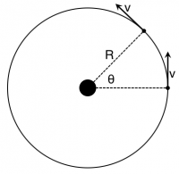
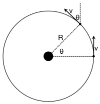

There are times when you will observe systems that move around some central axis in a very regular fashion. For example, the Moon revolves around the Earth in an orbit that is nearly circular. In doing so, it moves with nearly the same speed (not velocity!) at every location in its orbit. A system whose motion can be modeled as moving in a circular orbit at constant speed is said to execute “uniform circular motion.” It is called “uniform” because the speed of the system doesn't change. The velocity is always changing direction, but not size. **In these notes, you will read about a special mathematical form that the net force takes when the motion of the system is uniform and circular.**

## The Net Force for Uniform Circular Motion

The Moon orbiting the Earth with a speed $v$ and at a distance $R$ from the Earth.

Consider that the moon orbits the Earth with a constant speed. The figure to the right shows the set up. The Moon orbits the Earth with a constant speed, $v$, at a distance $R$ from the Earth. In a time $\Delta t$, the Moon has moved from one location (on the x-axis) to another location. It has moved an angular distance of $\theta$.

For this situation, we know the only force exerted on the Moon is [gravitational force](/notes/week-03-newtonian-gravitation/gravitation/) due to the Earth. Hence, the gravitational force is the net force. Using the [momentum principle](/notes/week-02-modeling-motion-net-force/momentum_principle/), you will find that the net force takes a special form in the case of uniform circular motion. Let's write down the momentum principle,

$$
{\overset{\rightarrow}{F}}_{net} = \frac{\Delta\overset{\rightarrow}{p}}{\Delta t} = m\frac{\Delta\overset{\rightarrow}{v}}{\Delta t}
$$

Because the mass of the Moon remains unchanged, we will only need to determine how the velocity is changing [1)](/notes/week-03-newtonian-gravitation/ucm/#fn__1). You can determine the vector components for both the final and initial velocities in the picture to the right. In the picture to the below, the angle $\theta$ that the final velocity makes with the vertical has been labeled [2)](/notes/week-03-newtonian-gravitation/ucm/#fn__2).

The final vector velocity can be decomposed along the x and y directions once you know which angle is $\theta$.

From this representation, we can find the components for the initial and final velocity vectors and apply the momentum principle to them:

$$
{\overset{\rightarrow}{F}}_{net} = m\frac{\Delta\overset{\rightarrow}{v}}{\Delta t} = m\frac{\langle - v\sin\theta,v\cos\theta\rangle - \langle 0,v\rangle}{\Delta t}
$$

where the final velocity vector has been decomposed along the $x$ and $y$ directions. You can perform a little algebra to clean up the formula.

$$
{\overset{\rightarrow}{F}}_{net} = m\frac{\langle - v\sin\theta,v\cos\theta - v\rangle}{\Delta t} = mv\frac{\langle - \sin\theta,\cos\theta - 1\rangle}{\Delta t}
$$

The time that it takes for the Moon to move through the angle $\theta$ is equal to the linear distance over which the Moon travels in that time divided by the speed at which it moves. The linear distance is the [length of the circular arc](http://en.wikipedia.org/wiki/Arc_length#Arcs_of_circles), which is equal to $R\theta$. Hence the time to move through the angle $\theta$ is given by:

$$
\Delta t = \frac{R\theta}{v}
$$

You can put that result into the previous formula to find that net force is given by:

$$
{\overset{\rightarrow}{F}}_{net} = \frac{mv^{2}}{R\theta}\langle - \sin\theta,\cos\theta - 1\rangle
$$

In fact, this is the *average* net force in this situation. You cannot get a more accurate estimate on this average net force without considering shorter times steps. That is, situations where the angular distance is very small. If you do consider such situations, the average net force becomes the instantaneous net force at the location. *To do this, we make the approximation that* $\theta$ *is very small.* In calculus, you might have seen [what happens to trig functions when their arguments get very small](https://en.m.wikibooks.org/wiki/Trigonometry/Power_Series_for_Cosine_and_Sine),

$$
\begin{matrix}
\sin\theta \approx \theta \\
\cos\theta \approx 1
\end{matrix}
$$

With this new assumption, you will find that the net force takes a simple form,

$$
{\overset{\rightarrow}{F}}_{net} = \frac{mv^{2}}{R\theta}\langle - \theta,0\rangle = \langle - \frac{mv^{2}}{R},0\rangle
$$

It is worth noting that through doing this mathematics, you have determined the mathematical form tha the net force takes when the moon is directly to the right of the Earth in the figures above. Notice that this form of the net force depends solely on the mass and speed of the Moon and the distance it is from the Earth. Moreover, it is perpendicular to the velocity (momentum) vector.

In uniform circular motion, we will find that the magnitude of the net force (the sum of all the real pushes and pulls) is equal to:

$$
F_{net,ucm} = \frac{mv^{2}}{R}
$$

and always points towards the inside of the circle. This is the direction that net force needs to be to keep the object moving in a circle. This [video demonstration](http://paer.rutgers.edu/pt3/experiment.php?topicid=1&exptid=56) illustrates applying a force inward to make a ball move in a circle. Sometimes this force is referred to as the ["centripetal force"](http://en.wikipedia.org/wiki/Centripetal_force)[3)](/notes/week-03-newtonian-gravitation/ucm/#fn__3).

## The Centripetal Force is not a Real Force

A force quantifies the interaction between pairs of objects. By this definition, the “centripetal force” is not a real force. It does not quantify the interaction between any pair of objects, it is a mathematical convenience when a system is moves in uniform circular motion. It is a conceptual and calculational tool.

The real forces are the interactions (real pushes and pulls) that give rise to the net force. It is just for the case of uniform circular motion that the net force can also be calculated using the the change in momentum, which takes on the $mv^{2}/R$ form. You might find many examples on the internet and (even in some books!) that claim otherwise, but the centripetal force does not result from the interaction of a pair of objects - it's not a real force.

------------------------------------------------------------------------

[1)](/notes/week-03-newtonian-gravitation/ucm/#fnt__1)

Remember that even though the speed remains unchanged, the velocity is always changing direction.

[2)](/notes/week-03-newtonian-gravitation/ucm/#fnt__2)

This is not a trivial geometry problem, convince yourself (by drawing it out!) that this angle is the same angle $\theta$ as the one that the Moon moves through.

[3)](/notes/week-03-newtonian-gravitation/ucm/#fnt__3)

The word centripetal means “center seeking” and refers to the fact the the net force is the case of uniform circular motion always points towards the inside of the circle.
