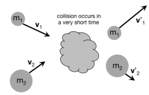
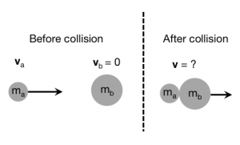

One situation where the concept of a [multi-particle system](/notes/week-04-05-springs-contact-interactions/mp_multi/) is incredibly useful, is when two objects collide with each other. In this situation, you will find that the momentum of the system before the collision and the momentum of the system after the collision are very nearly the same – that is, the system's momentum is *conserved*. **In these notes, you will read about collisions, how the conservation of momentum helps to explain those collisions, and how to predict various quantities of motion given conservation of momentum.**

# Momentum is never conserved

In real situations that you have observed in your everyday life, the momentum of a system is never conserved. There are always external interactions that act to change the system's momentum. That is, the momentum before is not equal to the momentum after. (Momentum uses SI units of **kg\*m/s**)

$$
\Delta{\overset{\rightarrow}{p}}_{sys} = {\overset{\rightarrow}{p}}_{sys,f} - {\overset{\rightarrow}{p}}_{sys,i} = {\overset{\rightarrow}{F}}_{surr}\Delta t
$$

$$
{\overset{\rightarrow}{p}}_{sys,f} = {\overset{\rightarrow}{p}}_{sys,i} + {\overset{\rightarrow}{F}}_{surr}\Delta t
$$

What you will do is consider when the external interactions are small enough or occur over a short enough time where the impulse delivered by the system's surroundings (${\overset{\rightarrow}{F}}_{surr}\Delta t$) can be neglected. That is, you will model the momentum of the system as approximately the same before and after. In this case the total momentum of the system remains approximately unchanged, but the interactions between particles within the system cause the momentum to change for those individual particles (albeit their vector sum is still the same).

### Sometimes, you can approximate that the system's momentum is conserved

The momentum of this system of two particles is approximately conserved before and after the collision.

*In some cases, the external interactions on the system can be neglected when compared to the internal interactions between particles in the system.* Think of a system of two particles that are going to collide (Figure to the right). In this situation, the particles in the system exert huge contact forces on each other as compared to external interactions (gravitational force, air resistance, etc.). Moreover, the collision occurs over a very short time. In this situation, the impulse delivered by the surroundings can be neglected (${\overset{\rightarrow}{F}}_{surr}\Delta t \approx 0$) because it's so small compared to the forces that the objects in the system experience due to each other. So, in this case, you have momentum conservation (to the extent we can say the external interactions don't really matter):

$$
\Delta{\overset{\rightarrow}{p}}_{sys} = {\overset{\rightarrow}{F}}_{surr}\Delta t \approx 0
$$

$$
{\overset{\rightarrow}{p}}_{sys,f} - {\overset{\rightarrow}{p}}_{sys,i} = 0
$$

$$
{\overset{\rightarrow}{p}}_{sys,f} = {\overset{\rightarrow}{p}}_{sys,i}
$$

The momentum of the system before the collision is equal to the momentum of the after the collision. The concept of a [multi-particle system](/notes/week-04-05-springs-contact-interactions/mp_multi/) greatly simplifies the situation because there's no need to calculate the forces that one object exerts on the other nor to worry about the time over which the collision occurs. This idea of momentum conservation is incredibly powerful and [helps us make predictions about the nature of the universe](http://home.web.cern.ch/topics/large-hadron-collider). But, remember that the application of momentum conservation to collisions requires that the collision occur over a short enough time to neglect the *external* interactions.

In the case you have been reading about, you can write down the momentum before and the momentum after the collision. You will read about a slight simpler case next.

$$
{\overset{\rightarrow}{p}}_{sys,f} = {\overset{\rightarrow}{p}}_{sys,i}
$$

$$
{\overset{\rightarrow}{p}}_{1,f} + {\overset{\rightarrow}{p}}_{2,f} = {\overset{\rightarrow}{p}}_{1,i} + {\overset{\rightarrow}{p}}_{2,i}
$$

$$
m_{1}{\overset{\rightarrow}{v}}_{1,f} + m_{2}{\overset{\rightarrow}{v}}_{2,f} = m_{1}{\overset{\rightarrow}{v}}_{1,i} + m_{2}{\overset{\rightarrow}{v}}_{2,i}
$$

Notice that conservation of momentum is a *vector* principle, which stemmed directly from the [momentum principle for multi-particle systems](/notes/week-04-05-springs-contact-interactions/mp_multi/). So, momentum is conserved in each direction:

$$
\langle p_{sys,xf},p_{sys,yf},p_{sys,zf}\rangle = \langle p_{sys,xi},p_{sys,yi},p_{sys,zi}\rangle
$$

That is, you (typically) have a system of three equations that describe how the momentum is conserved.

$$
p_{sys,xf} = p_{sys,xi} \rightarrow m_{1}v_{1,xf} + m_{2}v_{2,xf} = m_{1}v_{1,xi} + m_{2}v_{2,xi}
$$

$$
p_{sys,yf} = p_{sys,yi} \rightarrow m_{1}v_{1,yf} + m_{2}v_{2,yf} = m_{1}v_{1,yi} + m_{2}v_{2,yi}
$$

$$
p_{sys,zf} = p_{sys,zi} \rightarrow m_{1}v_{1,zf} + m_{2}v_{2,zf} = m_{1}v_{1,zi} + m_{2}v_{2,zi}
$$

## Momentum Conservation in One Dimension

Object A approaches and collides with Object B. Afterwards, they are stuck together.

To make this more concrete, consider the situation to the left where a single object (A) is moving towards another single object (B). In this situation, A is moving to the right with a known speed ($v_{A}$) while object B is at rest. After the collision, which occurs over a short time, A and B are stuck together moving at an unknown speed ($v$).

Because the collision occurs over a short time, the momentum of the system of A and B is conserved, so we can determine the speed with which A and B move together after the collision [1)](/notes/week-04-05-springs-contact-interactions/collisions/#fn__1).

$$
m_{A}{\overset{\rightarrow}{v}}_{A} + m_{b}{\overset{\rightarrow}{v}}_{B} = (m_{A} + m_{B})\overset{\rightarrow}{v}
$$

We choose the plus x-axis to the right, so that the $y$ and $z$ components of the momentum are zero. Because B is at rest to begin with, we get a single scalar equation:

$$
m_{A}v_{A} = (m_{A} + m_{B})v
$$

$$
v = \frac{m_{A}}{(m_{A} + m_{B})}v_{A}
$$

This is the speed that the objects have while moving together. Notice that this speed is less than the initial speed of A ($v < v_{A}$).

## Momentum Conservation in Two Dimensions

Two dimensional cases of momentum conservation are common, because often times the interactions (or collisions) occur on a flat plane (i.e., you can neglect the component of the momentum in the vertical direction). In this case, the momentum is conserved in both directions separately:

$$
\Delta{\overset{\rightarrow}{p}}_{sys} = {\overset{\rightarrow}{p}}_{sys,f} - {\overset{\rightarrow}{p}}_{sys,i} = 0
$$

So that the momentum of the system is some constant vector quantity,

$$
{\overset{\rightarrow}{p}}_{sys} = \langle p_{sys,x},p_{sys,y}\rangle = a\ constant\ vector
$$

And thus each component of the momentum is a constant scalar quantity,

$$
p_{sys,x} = a\ constant\ scalar
$$

$$
p_{sys,y} = some\ other\ constant\ scalar
$$

Notice that these can be different scalar quantities (and can be negative, too): ***the momentum is conserved in each direction.***

### Examples

- [Two students colliding](/examples/two_students_colliding/)
- [Deer Slug Example](/examples/deer_slug_example/)
- [Video Example: Two asteroids colliding in space](/examples/videoswk5/)

------------------------------------------------------------------------

[1)](/notes/week-04-05-springs-contact-interactions/collisions/#fnt__1)

They must move at the same speed, otherwise they wouldn't be connected together
