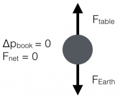
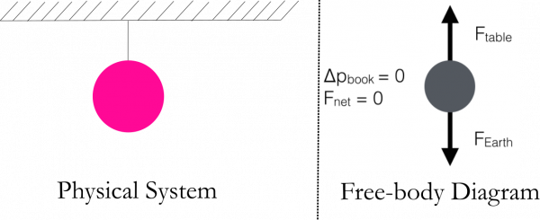
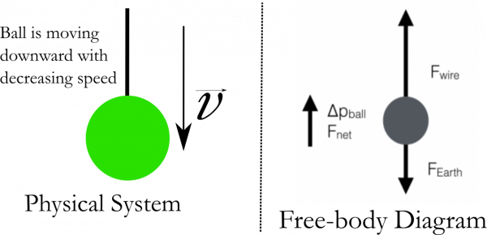

Free-body diagrams are one of the most useful tools in mechanics. They catalog all the forces acting on an object, and provide you with the necessary representation to make use of the [Momentum Principle](/notes/week-02-modeling-motion-net-force/momentum_principle/) (i.e., to find the direction of the net force acting on the object). **In these notes, you will read how to construct a free-body diagram and how it can help you reason about the direction of the net force on an object.**

#### Lecture Video



### The Point Particle and the Free-Body Diagram

When you are trying to determine the motion of a system, it is important to determine the [net force acting on the system](/notes/week-02-modeling-motion-net-force/momentum_principle/#net_force). In physics, we often model systems as “point-particles”, that is, we neglect the internal structure and extent of the system – crushing it down to a single point that experiences the same net force as the real system. *It is for this point particle that we draw the free-body diagram – a representation of all the forces acting on the system.*

 To be concrete, consider a book lying on a table as shown in the figure to the right. The two interactions the book experiences are with the Earth and the table. We quantify those interactions as the force that the table exerts upward on the book (${\overset{\rightarrow}{F}}_{table}$), and the force that the Earth exerts downward on the book (${\overset{\rightarrow}{F}}_{Earth}$). In this case, the book is not changing its momentum ($\Delta{\overset{\rightarrow}{p}}_{book} = 0$); in fact, it's not moving at all. So the [momentum principle](/notes/week-02-modeling-motion-net-force/momentum_principle/) tell us that the strength of those interactions (forces) are the same.

 You can represent these forces in a **free-body diagram** where we crush the book down to a point. You then position that tails of the force vectors on the point with the tips point in the direction of the interaction. The relative length of the arrows tells you about the relative strength of the forces. In this case of the book on the table, the arrows are the same size because the forces are the same strength (figure on the left).

It is often helpful to further indicate what you know about the change in momentum (or the acceleration) of the system (i.e., whether it's zero or non-zero and which way it points). This information tells you the direction of the net force and thus the relative strength of the individual forces acting on the system. This information is also indicated in the figure on the left.

## Further examples of free-body diagrams

### Hanging Ball

Consider a ball hanging from a wire attached to the ceiling. The forces acting on the system consisting of the ball are due to the Earth (${\overset{\rightarrow}{F}}_{Earth}$) and the wire (${\overset{\rightarrow}{F}}_{wire}$). The ball experiences no motion ($\Delta{\overset{\rightarrow}{p}}_{ball} = 0$) *and thus the net force acting on the ball is zero.* Hence, the two forces acting on the ball (due to different objects) are the same magnitude, but point in opposite directions. To be clear, [these forces are not Newton's 3rd Law pairs](/notes/week-03-newtonian-gravitation/gravitation/#newton_s_3rd_law) because they arise from different interactions the ball experiences. A free-body diagram that represents this situation is shown below.

The above free-body diagram is the same for a a ball being lowered or raised at *constant speed.* Can you see why?

### Ball lowered down; speed decreasing

Consider, instead, a ball attached to a wire that is being lowered, but the speed with which it is being lowered is decreasing. For example, you are setting a ball down on the floor, but doing so by changing the velocity of the ball so that it moves more slowly as it gets closer to the floor. To be clear, the ball has not yet touched the floor when you are analyzing its motion.

While the ball is begin lowered, it experiences two interactions: the force due to the Earth (${\overset{\rightarrow}{F}}_{Earth}$) downward and the force due to the wire (${\overset{\rightarrow}{F}}_{wire}$) upward. But now, the ball is changing its momentum ($\Delta{\overset{\rightarrow}{p}}_{ball} \neq 0$) because its speed is changing. In fact, the direction of the change in momentum is upward (the ball experiences a net force upward to slow its downward motion). From this, you can obtain that the upward force due to the wire is larger than the downward force due to the Earth. A free-body diagram that represents this situation is shown below.

