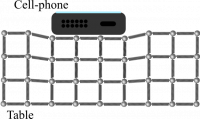
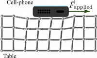

A microscopic perspective of materials helps to explain how contact interactions occur in nature. Contact interactions (forces) are not themselves [fundamental forces of nature](http://en.wikipedia.org/wiki/Fundamental_interaction), but they are the result of electrical forces between atoms. Compression and extension of materials occur not only at the [macroscopic level](/notes/week-06-solids-curved-motion/model_of_a_wire/#modeling_the_solid_wire), but also at the [microscopic level](/notes/week-06-solids-curved-motion/youngs_modulus/#hanging_a_mass_from_a_platinum_wire). **In these notes, you will read about how these ideas give rise to forces due to contact such as the [normal force](http://en.wikipedia.org/wiki/Normal_force) and dry [friction](http://en.wikipedia.org/wiki/Friction).**

## Forces due to contact

When two objects are in contact, their contact surfaces exert forces on each other. This is quite different from the gravitational force because while it acts on every piece of mass, as you will learn, *\_we consider that it acts at the [center of the of mass](http://en.wikipedia.org/wiki/Center_of_mass) of the object.* This assumption doesn't often affect our predictions and explanations of motion. In fact, in all the models that you have used so far, we haven't been concerned about exactly where the force acts on an object only that it does act.

For contact forces, (for a time) you will continue to use the assumption that we can just consider whether a contact force acts or not (And in what direction it acts). In the future, you might need to know precisely where it acts because [it might cause the motion to be a bit more complicated](/notes/week-11-multi-particle-energy/pp_vs_real/). For example, you can tip a box over if you push on it at the right location, but below that location it doesn't tip over.

### The Normal force

A cell phone placed on a stable compresses the table, which is why the normal force can change its size

You might know about the normal force from high school physics. It is poorly named because it doesn't identify the thing that exerts the force. For example when resting a cell phone on a table, it is the table that exerts the force not the “normal.” The word normal is meant to imply that this force is perpendicular to the surface on which the object rests.

The normal force is curious because it can change its size (so long as the object can support the applied load). The force that the table exerts can increase or decrease if the load changes. This is precisely because of the electrostatic interaction between atoms in the table. The load compresses the material more if it is heavier (figure to the right). Consider placing a cell phone of mass, m, on a horizontal table. The momentum principle tells you that the net force acting on the cell phone is zero (no momentum change) and hence:

$$
{\overset{\rightarrow}{F}}_{net} = {\overset{\rightarrow}{F}}_{normal} + {\overset{\rightarrow}{F}}_{grav} = 0
$$

$$
{\overset{\rightarrow}{F}}_{normal} = - {\overset{\rightarrow}{F}}_{grav} = \langle 0,mg\rangle
$$

$$
F_{normal} = mg
$$

Here, you can choose any cell phone (or computer, or brick!) and as long as the momentum change remains zero, and the table can support it, the “normal” force will be equal to the weight of the cell phone.

### Lecture Video



### Friction

Start pushing a brick on a table and the atoms rearrange a bit; they resist the motion

Friction is a resistive force that is due the contact between two objects. *While the normal force is perpendicular to the contact surfaces, the frictional force is parallel.* So, the vector sum of these two forces (when both are acting) is the force that the surface exerts on the object. That is, both the normal and frictional forces are due to the same contact interactions, they are often just separated into parallel and perpendicular components to the surface for convenience.
