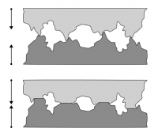

A microscopic perspective of materials helps to explain how contact interactions occur in nature. Contact interactions (forces) are not themselves [fundamental forces of nature](https://en.wikipedia.org/wiki/Fundamental_interaction), but they are the result of electrical forces between atoms. Compression and extension of materials occur not only at the [macroscopic level](/notes/week-06-solids-curved-motion/model_of_a_wire/#modeling_the_solid_wire), but also at the [microscopic level](/notes/week-06-solids-curved-motion/youngs_modulus/#hanging_a_mass_from_a_platinum_wire). **In these notes, you will read about how these ideas give rise to forces due to contact such as the [normal force](https://en.wikipedia.org/wiki/Normal_force) and dry [friction](https://en.wikipedia.org/wiki/Friction).**

## Forces due to contact

When two objects are in contact, their contact surfaces exert forces on each other. This is quite different from the gravitational force because while it acts on every piece of mass, as you will learn, *\_we consider that it acts at the [center of the of mass](https://en.wikipedia.org/wiki/Center_of_mass) of the object.* This assumption doesn't often affect our predictions and explanations of motion. In fact, in all the models that you have used so far, we haven't been concerned about exactly where the force acts on an object only that it does act.

For contact forces, (for a time) you will continue to use the assumption that we can just consider whether a contact force acts or not (And in what direction it acts). In the future, you might need to know precisely where it acts because [it might cause the motion to be a bit more complicated](/notes/week-11-multi-particle-energy/pp_vs_real/). For example, you can tip a box over if you push on it at the right location, but below that location it doesn't tip over.

### The Normal force

A cell phone placed on a stable compresses the table, which is why the normal force can change its size

You might know about the normal force from high school physics. It is poorly named because it doesn't identify the thing that exerts the force. For example when resting a cell phone on a table, it is the table that exerts the force not the “normal.” The word normal is meant to imply that this force is perpendicular to the surface on which the object rests.

The normal force is curious because it can change its size (so long as the object can support the applied load). The force that the table exerts can increase or decrease if the load changes. This is precisely because of the electrostatic interaction between atoms in the table. The load compresses the material more if it is heavier (figure to the right). Consider placing a cell phone of mass, m, on a horizontal table. The momentum principle tells you that the net force acting on the cell phone is zero (no momentum change) and hence:

$$
{\overset{\rightarrow}{F}}_{net} = {\overset{\rightarrow}{F}}_{normal} + {\overset{\rightarrow}{F}}_{grav} = 0
$$

$$
{\overset{\rightarrow}{F}}_{normal} = - {\overset{\rightarrow}{F}}_{grav} = \langle 0,mg\rangle
$$

$$
F_{normal} = mg
$$

Here, you can choose any cell phone (or computer, or brick!) and as long as the momentum change remains zero, and the table can support it, the “normal” force will be equal to the weight of the cell phone.

### Lecture Video



### Friction

Start pushing a brick on a table and the atoms rearrange a bit; they resist the motion

Friction is a resistive force that is due the contact between two objects. *While the normal force is perpendicular to the contact surfaces, the frictional force is parallel.* So, the vector sum of these two forces (when both are acting) is the force that the surface exerts on the object. That is, both the normal and frictional forces are due to the same contact interactions, they are often just separated into parallel and perpendicular components to the surface for convenience.

The roughness of two materials in contact shown at the microscopic level.

The force of friction results from [asperities in materials](https://en.wikipedia.org/wiki/Asperity_(materials_science)). The surfaces of almost all materials are rough at the microscopic level. As one object is dragged across another these rough bits bend as the surfaces move across, and then bend back as they pass each other. The asperities are moved out of equilibrium (their momentum changes) and then return. As a result, both materials heat up; the temperature of both objects rises. This, as you will learn, is [how friction dissipates energy](/notes/week-10-internal-energy-heat/energy_dissipation/).

You have certainly observed this in your everyday life. To move an object at constant speed often requires you to supply a constant force. In physics, you are told there's no need for a force to keep an object in motion. Friction helps us deal with this apparent violation to Newton's 1st law. If there's a frictional force opposing the motion, then the motion of the object will slow down unless there's a similarly sized constant force applied in the direction opposite of friction.

#### Friction can act in the direction of motion

Think about the next time you pick up a glass. The frictional force between your fingertips and the glass is in the direction of motion, namely bringing the glass to your mouth.

## Models of friction

We have two models of friction that each have their own mathematical representation. The first is sliding friction and the second is static friction.

### Sliding friction

When an object slides across a surface the asperities are constantly bend and returning, dissipating energy and causing the sliding object to slow down and heat up. While a connection between this microscopic view of friction and the macroscopic view is a topic of [current research](https://en.wikipedia.org/wiki/Friction#History), we do have a simple model that has worked well over the last few centuries. Here, the frictional force is proportional to the normal force and the constant of proportionality is an experimentally measured quantity called the “coefficient of kinetic friction.”

$$
F_{friction,sliding} \approx \mu_{k}F_{normal}
$$

This coefficient of kinetic friction ($\mu_{k}$) takes values between 0 and 1 depending on the two surfaces in contact, with closer to 1 meaning greater friction (i.e., more action by the asperities; often rougher surfaces).

This friction model doesn't depend on the speed of the object nor the area of the object. It's an approximate model not a fundamental force, but it's a good model for most macroscopic situations.

### Static friction

When an object isn't moving, but there is a definitely a friction force present, we have a situation where static friction is present. Consider an angled loading dock where a box rests on the dock but doesn't move. Similarly to the the sliding case, we don't have a fundamental understanding of these forces yet (because there's so many atoms involved), but a productive model has been one that is similar to the sliding friction model.

$$
F_{friction,static} \leq \mu_{s}F_{normal}
$$

The force due to static friction can change, but is no larger than the normal force times the coefficient of static friction ($\mu_{s}$). This constant also takes on values between 0 and 1 and depending on the two surfaces. But, it the case that the sliding friction coefficient is always less than the static friction coefficient for the same two materials.

$$
\mu_{k} \leq \mu_{s}
$$

If you are pushing a large box, for a time, the box won't move because your applied force hasn't exceeded $\mu_{s}F_{normal}$. Once it does, the box begins to slide (with friction) and the force you need to apply is reduced. However, if your applied force becomes less than $\mu_{k}F_{normal}$, then the box will stop sliding and you will have to exert a large force to get it moving again. This is the often called ["stick-slip"](https://en.wikipedia.org/wiki/Stick-slip_phenomenon) and occurs because the maximum static friction force between two surfaces is larger than the sliding friction force.

## Examples

- [holding_block_against_a_wall](/examples/holding_block_against_a_wall/)
- [sliding_to_a_stop](/examples/sliding_to_a_stop/)
