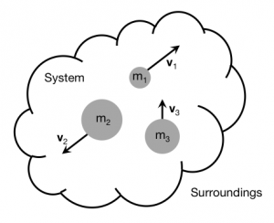

Until now, you've only considered systems of a [single particle](/notes/week-02-modeling-motion-net-force/momentum_principle/#system_and_surroundings). This greatly simplifies the concept of a system, but doesn't really communicate why the concept of a system is so essential to physics. When you have several objects in a system, we refer to these as “multi-particle systems.” **In these notes, you will read about multi-particle systems, why it is often advantageous to make use of them, and how the [momentum principle](/notes/week-02-modeling-motion-net-force/momentum_principle/) is defined for systems with several objects.**

### Lecture Video



## Multi-particle Systems

Earlier you read about the [concept of a system](/notes/week-02-modeling-motion-net-force/momentum_principle/#system_and_surroundings) as defining what objects you want to predict or explain the motion of. Anything outside of your system is the surroundings and can influence the system by changing some of its properties ([momentum](/notes/week-02-modeling-motion-net-force/momentum/), [energy](/notes/week-07-energy-transfer/point_particle/), and [angular momentum](/notes/week-12-14-collisions-rotational-motion/ang_momentum/)). Remember that the choice of system is arbitrary to the extent that you only care about predicting or explaining the motion of objects in your system.

Sometimes, it is advantageous (or necessary) to include more than one object in your system. Doing so, can often simplify things (e.g., when the momentum of the system does not change). To be clear, this is not just a [sleight of hand](https://en.wikipedia.org/wiki/Sleight_of_hand), but really about what motion you care about predicting or explaining.

### Linear Momentum of a Multi-particle System

A system of 3 particles, each with its own mass ($m_{i}$) and velocity (${\overset{\rightarrow}{v}}_{i}$).

To explain or predict the motion of a set of objects, you will need to learn how your understanding of the [momentum principle](/notes/week-02-modeling-motion-net-force/momentum_principle/) transfers to a system of several objects. Consider a system of three particles (figure to the right), each with its own mass ($m_{i}$) and velocity (${\overset{\rightarrow}{v}}_{i}$). As you probably recall, the momentum for a single particle (low-speed approximation) is $\overset{\rightarrow}{p} = m\overset{\rightarrow}{v}$, so that for any one of these particles, their momentum is the product of its mass and its velocity:

$$
{\overset{\rightarrow}{p}}_{i} = m_{i}{\overset{\rightarrow}{v}}_{i}
$$

The total momentum for this system is the vector sum of the individual momenta:

$$
{\overset{\rightarrow}{p}}_{sys} = \sum_{i}^{}{\overset{\rightarrow}{p}}_{i} = {\overset{\rightarrow}{p}}_{1} + {\overset{\rightarrow}{p}}_{2} + {\overset{\rightarrow}{p}}_{3}
$$

$$
{\overset{\rightarrow}{p}}_{sys} = \sum_{i}^{}m_{i}{\overset{\rightarrow}{v}}_{i} = m_{1}{\overset{\rightarrow}{v}}_{1} + m_{2}{\overset{\rightarrow}{v}}_{2} + m_{3}{\overset{\rightarrow}{v}}_{3}
$$

For this system, we have only 3 objects, but for other multi-particle systems, you may have more – you will just take the vector sum of all the individual particle momenta.

### The Momentum Principle for Multiple Particles

You have used the [momentum principle](/notes/week-02-modeling-motion-net-force/momentum_principle/) for a single particle a number of times.

$$
\frac{\Delta\overset{\rightarrow}{p}}{\Delta t} = {\overset{\rightarrow}{F}}_{net}
$$

As you have read, the rate of change of the momentum for a single particle is due to the interactions that the object has with its surroundings – these interactions add to give rise to a net *external* force. The word external is key because the interactions must be outside the system of the single object. ***An object cannot exert forces on itself in ways to change its own momentum.***

In a multi-particle system, objects within the system interact with each other and exert forces on each other. However, the total momentum of the system can only change due to *external forces*. The momentum principle for a multi-particle system states that the change in the system's momentum ($\Delta{\overset{\rightarrow}{p}}_{sys}$) arises from interactions with the system's surroundings (${\overset{\rightarrow}{F}}_{surr}\Delta t$):

$$
\Delta{\overset{\rightarrow}{p}}_{sys} = {\overset{\rightarrow}{F}}_{surr}\Delta t
$$

or in the case where you must consider instantaneous changes to the momentum:

$$
\frac{d{\overset{\rightarrow}{p}}_{sys}}{dt} = {\overset{\rightarrow}{F}}_{surr}
$$

#### Understanding the Multi-particle Momentum Principle

How can you make sense of the multi-particle momentum principle? Let's consider how you arrive at that principle: let's service it for the the system of three particles in the figure above. In that case the change in the system's momentum is given by the sum of the changes in momentum of each individual particle:

$$
\frac{d{\overset{\rightarrow}{p}}_{sys}}{dt} = \frac{d}{dt}\left( \sum_{i}^{}{\overset{\rightarrow}{p}}_{i} \right) = \sum_{i}^{}\left( \frac{d{\overset{\rightarrow}{p}}_{i}}{dt} \right) = \frac{d{\overset{\rightarrow}{p}}_{1}}{dt} + \frac{d{\overset{\rightarrow}{p}}_{2}}{dt} + \frac{d{\overset{\rightarrow}{p}}_{3}}{dt}
$$

Let's consider just the change in momentum of particle 1, which is equal to the net force on particle 1 due to all the interactions with particle 1:

$$
\frac{d{\overset{\rightarrow}{p}}_{1}}{dt} = {\overset{\rightarrow}{F}}_{net,1} = {\overset{\rightarrow}{F}}_{by\ 2\ on\ 1} + {\overset{\rightarrow}{F}}_{by\ 3\ on\ 1} + {\overset{\rightarrow}{F}}_{by\ surr\ on\ 1}
$$

For each of the particles, you will have similar equations for their changes in momentum:

$$
\frac{d{\overset{\rightarrow}{p}}_{2}}{dt} = {\overset{\rightarrow}{F}}_{net,2} = {\overset{\rightarrow}{F}}_{by\ 1\ on\ 2} + {\overset{\rightarrow}{F}}_{by\ 3\ on\ 2} + {\overset{\rightarrow}{F}}_{by\ surr\ on\ 2}
$$

$$
\frac{d{\overset{\rightarrow}{p}}_{3}}{dt} = {\overset{\rightarrow}{F}}_{net,3} = {\overset{\rightarrow}{F}}_{by\ 1\ on\ 3} + {\overset{\rightarrow}{F}}_{by\ 2\ on\ 3} + {\overset{\rightarrow}{F}}_{by\ surr\ on\ 3}
$$

However, any force that particle 2 or 3 exert on particle 1 is exactly the same size, but opposite in direction to the force that particle 1 exerts on particle 2 or 3. That is, [Newton's 3rd Law of Motion](http://en.wikipedia.org/wiki/Newton's_laws_of_motion#Newton.27s_3rd_Law) states that an interaction is between pairs of particles and the force (size and direction of the interaction) that we calculate is precisely the same size for each particle (just exerted in opposing directions). More concretely, this means that when you do the vector addition of momentum changes, the force that particle 2 exerts on particle 1 is “cancelled” by the force that particle 1 exerts on particle 2,

$$
{\overset{\rightarrow}{F}}_{by\ 2\ on\ 1} = - {\overset{\rightarrow}{F}}_{by\ 1\ on\ 2}
$$

This is true for all such pairs, so that the vector addition of the changes in momentum result in:

$$
\frac{d{\overset{\rightarrow}{p}}_{sys}}{dt} = \frac{d{\overset{\rightarrow}{p}}_{1}}{dt} + \frac{d{\overset{\rightarrow}{p}}_{2}}{dt} + \frac{d{\overset{\rightarrow}{p}}_{3}}{dt} = {\overset{\rightarrow}{F}}_{by\ surr\ on\ 1} + {\overset{\rightarrow}{F}}_{by\ surr\ on\ 2} + {\overset{\rightarrow}{F}}_{by\ surr\ on\ 3} = {\overset{\rightarrow}{F}}_{surr}
$$

$$
\frac{d{\overset{\rightarrow}{p}}_{sys}}{dt} = {\overset{\rightarrow}{F}}_{surr}
$$

That is the rate of change of the system's momentum due to all the interactions that are external to the system. The individual particles within the system change their momentum due to both internal and external interactions, but if you only care about the system as a whole, you only need to worry about the external forces on the system.

Alternatively, if the force is roughly constant over some time interval, the impulse delivered to the system (calculated as ${\overset{\rightarrow}{F}}_{surr}\Delta t$) changes the momentum of the system ($\Delta{\overset{\rightarrow}{p}}_{sys}$).

$$
\Delta{\overset{\rightarrow}{p}}_{sys} = {\overset{\rightarrow}{F}}_{surr}\Delta t
$$
