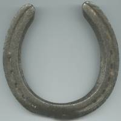

In a system of multiple particles, each particle has its own motion. But often, its useful to think about the collective motion of these objects. By “collective motion”, you are looking to understand how the whole system is moving: Is it stationary and objects rotate around? Is there some net translation (movement to the right or left)? Or something more peculiar? **In these notes you will read about the concept of the center of mass, which helps us track the overall motion of a system.**

## Lecture Video



## The Center of Mass

The center of mass is a concept that helps us understand how the motion of a multi-particle system evolves with time. It is connected very strongly to the total momentum of a system as you will read.

### Flocking birds



*(This video is intended for visual learning assistance. Auditory Components are not necessary.)*

It's hard to think about what the motion of a system of objects means without some sort of example. The video above shows the motion of a flock of birds. Each individual bird flies in with its own direction and speed, but the flock (or the bulk) moves in a particular way (it appears to move in a circle or ellipse) that your eye can follow. What you are paying attention to is the motion of the “center” of the bulk. It is this concept that you are going to read about below.

### Calculating the center of mass

The center of mass of a system is the weighted average of the particles in that system. Consider a set of three particles with different mass ($m_{i}$), which are all located a different locations relative to the origin (${\overset{\rightarrow}{r}}_{i}$). For these three particles, the center of mass of that system is the vector sum.

$$
{\overset{\rightarrow}{r}}_{cm} = \frac{m_{1}{\overset{\rightarrow}{r}}_{1} + m_{2}{\overset{\rightarrow}{r}}_{2} + m_{3}{\overset{\rightarrow}{r}}_{3}}{m_{1} + m_{2} + m_{3}} = \frac{1}{M_{tot}}\left( m_{1}{\overset{\rightarrow}{r}}_{1} + m_{2}{\overset{\rightarrow}{r}}_{2} + m_{3}{\overset{\rightarrow}{r}}_{3} \right)
$$

So that, in general, for objects in a multi-particle system that have known locations,

$$
{\overset{\rightarrow}{r}}_{cm} = \frac{\sum_{i}^{}m_{i}{\overset{\rightarrow}{r}}_{i}}{\sum_{i}^{}m_{i}} = \frac{1}{M_{tot}}\left( \sum_{i}^{}m_{i}{\overset{\rightarrow}{r}}_{i} \right)
$$

The center of mass for this horseshoe is outside of the horseshoe itself.

The center of mass is a construct, there might be an object located at the center of mass, but there doesn't have to be. Consider the horseshoe to the right. Where is the center of mass for this object?

The horseshoe example leads to a different way of calculating the center of mass. Albeit, you can still think about it as adding all the bits of mass weighted by their locations. In the case of the horseshoe the system is a bunch of atoms that make up the horseshoe. But we don't add them up in discrete pieces [1)](/notes/week-06-solids-curved-motion/center_of_mass/#fn__1). Instead, we take infinitesimally small chunks of mass ($dm$) and sum over them continuously (using an integral).

$$
r_{cm} = \frac{\int\overset{\rightarrow}{r}dm}{\int dm} = \frac{1}{M_{tot}}\left( \int\overset{\rightarrow}{r}dm \right)
$$

This form can be challenging to use because you will have to determine $dm$ in terms of the position vector and decide what the limits of the integral will be. There's a simpler example below to help you with this (if you ever need to use this form).

## Motion of the center of mass

The motion of the center of mass can be found by taking the time derivative of the center of mass formula. This will give you the velocity of the center of mass, which you can use to explain the collective motion of that system.

$$
{\overset{\rightarrow}{v}}_{cm} = \frac{d{\overset{\rightarrow}{r}}_{cm}}{dt} = \frac{1}{M_{tot}}\frac{d}{dt}\left( m_{1}{\overset{\rightarrow}{r}}_{1} + m_{2}{\overset{\rightarrow}{r}}_{2} + m_{3}{\overset{\rightarrow}{r}}_{3} + \ldots \right)
$$

$$
{\overset{\rightarrow}{v}}_{cm} = \frac{1}{M_{tot}}\left( m_{1}{\overset{\rightarrow}{v}}_{1} + m_{2}{\overset{\rightarrow}{v}}_{2} + m_{3}{\overset{\rightarrow}{v}}_{3} + \ldots \right)
$$

so, the velocity of the center of mass of a system (${\overset{\rightarrow}{v}}_{cm}$) is the weighted average of the velocity of each particle in the system. We can also see that the momentum of the system is related directly to the center of mass velocity.

$$
{\overset{\rightarrow}{v}}_{cm} = \frac{1}{M_{tot}}\left( {\overset{\rightarrow}{p}}_{1} + {\overset{\rightarrow}{p}}_{2} + {\overset{\rightarrow}{p}}_{3} + \ldots \right)
$$

$$
M_{tot}{\overset{\rightarrow}{v}}_{cm} = {\overset{\rightarrow}{p}}_{1} + {\overset{\rightarrow}{p}}_{2} + {\overset{\rightarrow}{p}}_{3} + \ldots
$$

$$
M_{tot}{\overset{\rightarrow}{v}}_{cm} = \sum_{i}^{}{\overset{\rightarrow}{p}}_{i} = {\overset{\rightarrow}{p}}_{sys}
$$

So you can think of the velocity of the center of mass (${\overset{\rightarrow}{v}}_{cm}$) as a single particle that has the total mass of the system ($M_{tot}$), which moves like it has the total momentum of the system (${\overset{\rightarrow}{p}}_{sys}$).

### Simulation of the motion of the center of mass

The simulation below shows a binary star (red star and yellow star) system where the total momentum of the system is non-zero, but because there are no external forces to the two particle system, the center of mass moves with constant momentum (green sphere and line).



## Examples

- [Walking in a Boat](/examples/walking_in_a_boat/)

------------------------------------------------------------------------

[1)](/notes/week-06-solids-curved-motion/center_of_mass/#fnt__1)

We could, but we'd only get an approximate answer where the accuracy depends on how small the chunks are.
