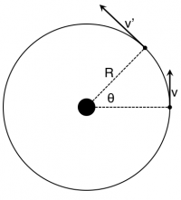
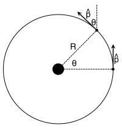
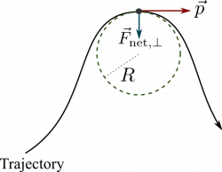

The motion of objects is not limited to [straight line motion](/notes/week-01-modeling-motion-no-net-force/displacement_and_velocity/). As you read earlier, [forces can change the momentum of objects](/notes/week-02-modeling-motion-net-force/momentum_principle/) (including the direction of that momentum). These interactions can produce [projectile motion](/notes/week-02-modeling-motion-net-force/localg/), [circular motion](/notes/week-03-newtonian-gravitation/ucm/), [oscillations](/notes/week-04-05-springs-contact-interactions/springmotion/), or more generalized trajectories. **In these notes, you will read about how to model more generalized motion using the [momentum principle](/notes/week-02-modeling-motion-net-force/momentum_principle/).**

## Lecture Video



## The Derivative form of the Momentum Principle

Earlier, you read about the [momentum principle](/notes/week-02-modeling-motion-net-force/momentum_principle/), and how interactions with a system's surroundings can change the momentum of a system. This principle was stated as a macroscopic change $\Delta\overset{\rightarrow}{p} = {\overset{\rightarrow}{F}}_{net}\Delta t$. That is, the time change is some reasonably measurable amount. However, when we considered very short time intervals, so short that the momentum could be changing all the time, we found that this principle was transformed to the derivative form [1)](/notes/week-06-solids-curved-motion/curving_motion/#fn__1).

$$
\frac{d\overset{\rightarrow}{p}}{dt} = {\overset{\rightarrow}{F}}_{net}
$$

As you've read, [any vector can be written as the product of its magnitude and unit vector](/notes/week-01-modeling-motion-no-net-force/scalars_and_vectors/#defining_vectors_mathematically). In particular, you can write the momentum vector in this way,

$$
\overset{\rightarrow}{p} = |\overset{\rightarrow}{p}|\widehat{p}
$$

If you plug this into the derivative form of the momentum principle, you can then take the derivative of each piece of the product. This mathematical operation is called the ["Chain rule."](http://en.wikipedia.org/wiki/Chain_rule)

$$
{\overset{\rightarrow}{F}}_{net} = \frac{d\overset{\rightarrow}{p}}{dt} = \frac{d|\overset{\rightarrow}{p}|}{dt}\widehat{p} + |\overset{\rightarrow}{p}|\frac{d\widehat{p}}{dt}
$$

Evidently, you can rewrite the momentum principle as the sum of two parts: a part that points along the direction of the momentum (the $\widehat{p}$ part) and another part that points in the direction that the momentum is changing (the $d\widehat{p}/dt$ part).

## A change in speed

The first half of the momentum change describes how the magnitude of the momentum changes ($d|\overset{\rightarrow}{p}|/dt$). This vector will point in the direction of the momentum vector if $d|\overset{\rightarrow}{p}|/dt > 0$ and opposite the direction of the momentum vector if $d|\overset{\rightarrow}{p}|/dt < 0$. If the momentum is not changing ($d|\overset{\rightarrow}{p}|/dt = 0$), then this vector is zero.

This sign and size of this vector tells you how the speed of the object is changing. Is it speeding up ($d|\overset{\rightarrow}{p}|/dt > 0$)? Slowing down ($d|\overset{\rightarrow}{p}|/dt < 0$)? Or moving at constant speed ($d|\overset{\rightarrow}{p}|/dt = 0$)?

The change in the magnitude of the momentum is the result of the component of the net force that is parallel to the direction of motion (momentum). This component is referred to as “F net parallel” or ${\overset{\rightarrow}{F}}_{net, \parallel}$. Some also call this force the “tangential component of the net force”; it is always tangent to the trajectory of the object. So, we have a relationship between this force component and the change in the magnitude of the momentum.

$$
{\overset{\rightarrow}{F}}_{net, \parallel} = \frac{d|\overset{\rightarrow}{p}|}{dt}\widehat{p}
$$

## A change in direction

The second half of the momentum change describes how the direction of the momentum is changing ($d\widehat{p}/dt$) and will always point in the direction that the momentum is changing. This direction is always perpendicular to the tangent of the path, and pointing in the direction of the turn. Let's see how that's the case.

A car driving on a circle track speeding up: v' is larger than v.

Consider a car that is speeding up as it drives on a circular track (Figure to the right). In this case, the velocity vector is always tangent to the path (or the track), but it gets longer; the car speeds up. However, the unit vector for the velocity is always the same length and just changes direction. Because [the velocity and the momentum always point in the same direction](/notes/week-02-modeling-motion-net-force/momentum/), the momentum unit vector also just changes direction (Figure below and to the left).

While the magnitude of the momentum changes, the length of a unit vector is always 1.

As [you have seen before](/notes/week-03-newtonian-gravitation/ucm/), you can track the angle $\theta$ through which the car moves on this circular track to determine how the direction is changing. The challenging part is determining where the angle $\theta$ is measured from for the final momentum direction. In the figure below and to the left, you can see that the initial momentum unit vector is in the $+ y$-direction (${\widehat{p}}_{i} = \langle 0,1\rangle$) and the final momentum unit vector has components in both the $- x$-direction and the $+ y$-direction (${\widehat{p}}_{f} = \langle - \sin\theta,\cos\theta\rangle$). In this case, you are trying to determine the change in the direction of the unit vector over this interval.

$$
\frac{\Delta\widehat{p}}{\Delta t} = \frac{{\widehat{p}}_{f} - {\widehat{p}}_{i}}{\Delta t} = \frac{\langle - \sin\theta,\cos\theta\rangle - \langle 0,1\rangle}{\Delta t} = \frac{\langle - \sin\theta,\cos\theta - 1\rangle}{\Delta t}
$$

[As before](/notes/week-03-newtonian-gravitation/ucm/), we can find the time ($\Delta t$) that it takes for the object to move through the arc length ($R\theta$) – but, in this case, the velocity at which it does this is the average between the initial and final location (because the object is speeding up).

$$
v_{avg} = \frac{R\theta}{\Delta t}\quad\quad \rightarrow \quad\quad\Delta t = \frac{R\theta}{v_{avg}}
$$

And thus you find that the change in the direction of the unit vector is given by:

$$
\frac{\Delta\widehat{p}}{\Delta t} = \frac{v_{avg}}{R\theta}\langle - \sin\theta,\cos\theta - 1\rangle
$$

As [you read before](/notes/week-03-newtonian-gravitation/ucm/), you can take the limit of smaller and smaller arc lengths, and thus smaller $\theta$, to arrive at the differential form:

$$
\frac{d\widehat{p}}{dt} = \frac{|\overset{\rightarrow}{v}|}{R\theta}\langle - \theta,0\rangle = \frac{|\overset{\rightarrow}{v}|}{R}\langle - 1,0\rangle
$$

where you are using the approximation for small $\theta$ in both the cosine ($\cos\theta \approx 1$) and sine ($\sin\theta \approx \theta$). Here, the average velocity is replaced by the instantaneous because you are looking at infinitesimally short time interval. This vector points in the $- x$-direction, which is toward the turn and perpendicular to the direction of the momentum vector. This result generalizes to:

$$
\frac{d\widehat{p}}{dt} = \frac{|\overset{\rightarrow}{v}|}{R}\widehat{n}
$$

The perpendicular component of the net force points inward towards the turn.

where the unit vector, $\widehat{n}$, always points inward towards the turn. For more general trajectories, the value of $R$ is the radius of curvature of the arc, that is, it is the radius of the circle that has exactly the same curvature at the location of interest.

The change in the direction of the momentum is the result of the component of the net force that is perpendicular to the direction of motion (momentum). This component is referred to as “F net perpendicular” or ${\overset{\rightarrow}{F}}_{net,\bot}$. Some also call this force the “centripetal component of the net force”; it is always perpendicular to the tangent to the trajectory of the object. So, we have a relationship between this force component and the change in the magnitude of the momentum.

$$
{\overset{\rightarrow}{F}}_{net,\bot} = |\overset{\rightarrow}{p}|\frac{d\widehat{p}}{dt} = \frac{|\overset{\rightarrow}{p}||\overset{\rightarrow}{v}|}{R}\widehat{n} = \frac{mv^{2}}{R}\widehat{n}
$$

## Relationship to the tangential and centripetal accelerations

In your previous studies, you might have come across the [tangential acceleration](http://en.wikipedia.org/wiki/Acceleration#Tangential_and_centripetal_acceleration) (${\overset{\rightarrow}{a}}_{t}$) and the [centripetal acceleration](http://en.wikipedia.org/wiki/Acceleration#Tangential_and_centripetal_acceleration) (${\overset{\rightarrow}{a}}_{c}$). These are directly connected to the definitions of the parallel and perpendicular components of the net force. You can write the net force as the sum of these parallel and perpendicular components, which arise from the tangential and centripetal accelerations.

$$
{\overset{\rightarrow}{F}}_{net} = {\overset{\rightarrow}{F}}_{\parallel} + {\overset{\rightarrow}{F}}_{\bot}
$$

$$
{\overset{\rightarrow}{F}}_{\parallel} = m{\overset{\rightarrow}{a}}_{t} = ma_{t}\widehat{p}\quad\quad{\overset{\rightarrow}{F}}_{\bot} = m{\overset{\rightarrow}{a}}_{c} = ma_{c}\widehat{n}
$$

The direction of each of these accelerations is the same as their corresponding forces. The tangential acceleration is tangent to the path, and this points in the $\widehat{p}$ direction (or opposite it in the case of negative acceleration). The centripetal acceleration is perpendicular to the path and points in the $\widehat{n}$ direction. You can use the magnitudes of each force component to determine formulae for the accelerations.

$$
F_{\parallel} = ma_{t} = \frac{d|\overset{\rightarrow}{p}|}{dt} = \frac{d|m\overset{\rightarrow}{v}|}{dt} = m\frac{d|\overset{\rightarrow}{v}|}{dt}\quad\quad \rightarrow \quad\quad a_{t} = \frac{d|\overset{\rightarrow}{v}|}{dt}
$$

The tangential acceleration tells you how the speed of the object changes, just as the parallel component of the net force is responsible for this speeding up and slowing down.

$$
F_{\bot} = ma_{c} = \frac{|\overset{\rightarrow}{p}||\overset{\rightarrow}{v}|}{R} = \frac{mv^{2}}{R} = m\frac{v^{2}}{R}\quad\quad \rightarrow \quad\quad a_{c} = \frac{v^{2}}{R}
$$

The centripetal acceleration tells you how the direction of the object's motion changes, just as the perpendicular component of the net force is responsible for this directional change.

## Video of Bowling Ball Moving in a Circle

In this video a bowling ball is forced to move in a circle by being struck with a sledgehammer. This video was originally collected by [Eugenia Etkina and David Brookes](http://paer.rutgers.edu/).

[bowlingball.mp4](https://msuperl.org/wikis/pcubed/lib/exe/fetch.php?cache=&media=183_notes:bowlingball.mp4)

## Examples

- [Video Example: Change in momentum (parallel and perpendicular) of an orbit](https://www.msuperl.org/wikis/pcubed/doku.php?id=183_notes:examples:videoswk6)

------------------------------------------------------------------------

[1)](/notes/week-06-solids-curved-motion/curving_motion/#fnt__1)

Mathematically, this is the result of taking the the limit as $\Delta t$ goes to zero.
